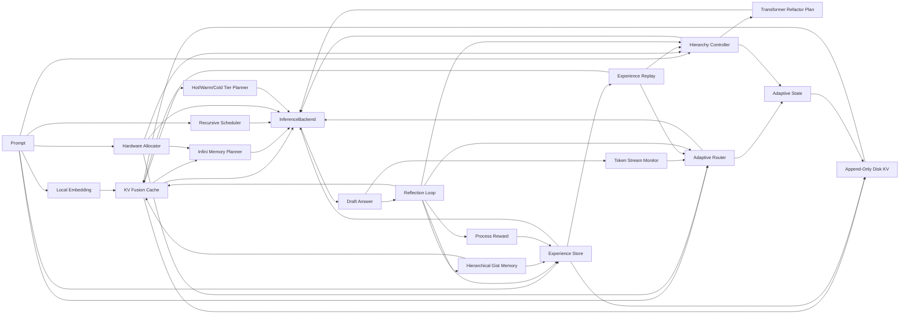

# rust-norion

`rust-norion` is a Rust prototype for a local Noiron-style self-evolving
inference control layer for self-developed Transformer runtimes.

`rust-norion` 是一个用 Rust 编写的本地 Noiron 风格自进化推理控制层原型，默认面向自主训练的
Transformer 运行时。

## Project Goal / 项目目标

The goal is to build a practical, sovereignty-first local inference control
engine that can make a self-developed model backend behave more adaptively over
time without retraining model weights on every interaction.

本项目目标是构建一个实用、自主可控优先的本地推理控制引擎，让自研模型后端在不频繁重训权重的前提下，能够随着使用逐步调整推理策略、记忆选择和计算分配。

The optimized target combines five non-negotiable requirements:

优化后的目标由五个硬约束共同定义：

- self-developed model stack: the default backend is a self-trained
  Transformer-family model, not external weights
- anti lock-in: no closed model service, vendor-only runtime, or opaque
  quantization path in the core engine
- extreme local deployment: offline-first, lightweight, disk-backed memory,
  and ultra-long-context control for consumer or edge hardware
- universal device adaptation: laptops, desktops, workstations, servers,
  phones, tablets, embedded boards, NPU/AI accelerator devices, and
  heterogeneous multi-GPU machines should all map into explicit hardware
  profiles that tune latency, KV budgets, routing pressure, and hierarchy
  weights
- frontier algorithms as owned implementations: use public papers as
  inspiration, but implement attention, memory, quantization, routing,
  reflection, and scheduling locally in Rust

- 自研模型栈：默认后端是自主训练的 Transformer 系列模型，而不是外部权重
- 规避卡脖子：核心引擎不绑定闭源模型服务、厂商专用运行时或不透明量化路径
- 极致本地化部署：离线优先、轻量化、磁盘记忆、面向消费级/边缘硬件的超长上下文控制
- 全设备适配：笔记本、台式机、工作站、服务器、手机、平板、嵌入式板卡、NPU/AI 加速器设备以及异构多 GPU 机器，都应映射到明确的硬件 profile，用于调整延迟、KV budget、路由压力和层级权重
- 前沿算法自主实现：公开论文只作为思想来源，注意力、记忆、量化、路由、反思和调度都在 Rust 中本地实现

The project focuses on the control loop around inference:

项目重点不是从零实现完整大模型，而是实现推理外层闭环：

- multi-factor adaptive routing: decide when a token should use projection,
  local-window attention, global attention, or convolutional fusion based on
  entropy, task profile, context length, cache hit rate, and latency pressure
- reinforced KV memory: store useful context, fuse similar memories, weaken bad
  memories, and persist local state
- task-aware hierarchy: shift global, local, and convolution-style compute
  weights for coding, writing, general reasoning, or long-document tasks
- Rust-native Transformer refactor planning: express global, local-window, and
  convolutional-fusion layer plans as explicit Rust data structures
- reflection loop: score drafts, detect weak outputs, revise confidence, and
  decide what should become reusable memory
- backend abstraction: keep the control layer independent from the actual model
  runtime

- 多因子自适应路由：基于熵、任务类型、上下文长度、缓存命中率和延迟压力，判断 token 应该走投影、局部窗口注意力、全局注意力还是卷积融合
- 强化式 KV 记忆：保存有用上下文，融合相似记忆，削弱错误记忆，并持久化到本地
- 任务感知层级调度：针对代码、写作、通用推理、长文档任务调整全局/局部/卷积式计算权重
- Rust 原生 Transformer 重构规划：用明确的 Rust 数据结构表达全局注意力、局部窗口注意力和卷积融合层计划
- 反思闭环：评估草稿质量，发现薄弱输出，修正置信度，并决定是否写入可复用记忆
- 后端抽象：让控制层与真实模型运行时解耦

## Self-Owned Stack / 自主双栈

`rust-norion` is designed as an Agent Harness and test-time scaling control
plane around a self-owned Transformer runtime:

`rust-norion` 的架构定位是围绕自研 Transformer 运行时的 Agent Harness 与
Test-time Scaling 控制平面：

- model runtime: owns tokenizer, embeddings, weights, native context window,
  forward kernels, and optional KV import/export
- control plane: owns recursive scheduling, adaptive routing, memory tiering,
  sparse context filtering, reflection, RLVR-style process rewards, experience
  replay, and persisted adaptive state
- stable boundary: `ModelRuntime` and `InferenceBackend` keep model iteration
  independent from routing, memory, and reflection iteration

- 模型运行时：负责 tokenizer、embedding、权重、原生上下文窗口、前向计算内核，以及可选的 KV 导入/导出
- 控制平面：负责递归调度、自适应路由、记忆分层、稀疏上下文筛选、反思、RLVR 风格过程奖励、经验回放和持久化自适应状态
- 稳定边界：通过 `ModelRuntime` 和 `InferenceBackend` 让模型迭代与路由、记忆、反思迭代解耦

## Sovereignty Scope / 自主可控范围

The default target is a self-trained Transformer-family model. The core project
does not depend on Gemma, Llama, Qwen, closed model services, or vendor-specific
runtime features. Public papers and open algorithm ideas can guide the design,
but quantization, attention routing, memory scheduling, reflection, and adaptive
state should be implemented as local Rust components.

默认目标是自主训练的 Transformer 系列模型。核心项目不依赖 Gemma、Llama、Qwen、闭源模型服务或厂商绑定运行时能力。可以借鉴公开论文和开放算法思想，但量化、注意力路由、记忆调度、反思闭环和自适应状态都应作为本地 Rust 组件自主实现。

All semantic filtering, gist generation, and memory scoring should prefer the
self-developed model's own tokenizer and embeddings. The project should not add
a second third-party encoder just to make memory retrieval work.

语义筛选、gist 生成和记忆评分优先复用自研模型自身的 tokenizer 与 embedding。项目不应为了记忆检索再引入第二套第三方编码器。

## Local Algorithm Stack / 本地算法栈

The target algorithm stack is model-weight independent:

目标算法栈与具体模型权重解耦：

- ultra-long context: Infini-style global/local KV separation, recursive
  long-context scheduling, hierarchical gist memory, and SpeContext-style
  sparse KV filtering
- lightweight KV system: self-owned 4/8-bit uniform KV quantization,
  reinforced KV-Fusion, time decay, semantic clustering, and Hot/Warm/Cold
  storage
- self-evolution loop: test-time scaling, RLVR-style rewards for control
  decisions, reflection scoring, drift gates, and experience replay
- Rust Transformer refactor: explicit layer templates for local-window,
  global-memory, and convolutional-fusion compute paths

- 超长上下文：Infini 风格全局/局部 KV 分离、递归长上下文调度、层级 gist 记忆、SpeContext 风格稀疏 KV 筛选
- 轻量 KV 系统：自研 4/8-bit uniform KV 量化、强化式 KV-Fusion、时间衰减、语义聚类和 Hot/Warm/Cold 分层存储
- 自进化闭环：Test-time Scaling、针对控制决策的 RLVR 风格奖励、反思评分、漂移门控和经验回放
- Rust Transformer 重构：用显式层模板表达局部窗口、全局记忆、卷积融合等计算路径

## Current Status / 当前状态

This repository currently contains a working control-plane prototype. It does
not yet include the self-developed Transformer runtime or production inference
kernels.

当前仓库已经包含一个可运行的控制层原型，但还没有接入自研 Transformer 运行时或生产级推理内核。

Implemented modules:

已实现模块：

- `src/router.rs`: multi-factor adaptive router
- `src/adaptive_state.rs`: persisted router, hierarchy, and tier-plan control state
- `src/disk_kv.rs`: append-only disk-backed KV store
- `src/infini_memory.rs`: Infini-style global/local memory planner with sparse token-budget filtering
- `src/kv_cache.rs`: reinforced KV fusion cache with disk persistence and retention policy
- `src/kv_exchange.rs`: shared runtime KV block type for import/export between Noiron and model runtimes
- `src/kv_quant.rs`: self-owned 4/8-bit uniform KV vector quantization
- `src/recursive_scheduler.rs`: native-window-aware recursive long-context scheduler
- `src/tiered_cache.rs`: Hot/Warm/Cold memory tier scheduler with migration traces
- `src/token_stream.rs`: generated-token window monitor for router feedback
- `src/experience.rs`: structured reflection experience store
- `src/experience_replay.rs`: reward-ranked experience replay planner
- `src/gist_memory.rs`: hierarchical document/section/paragraph gist memory generator
- `src/hardware.rs`: device-agnostic hardware pressure and compute allocation planner for CPU-only, integrated GPU, discrete GPU, unified-memory, mobile, embedded, NPU/AI accelerator, multi-GPU, edge, and server profiles
- `src/process_reward.rs`: RLVR-style process reward scoring for control decisions
- `src/transformer.rs`: Rust-native Transformer layer refactor planner
- `src/hierarchy.rs`: task-profile hierarchy controller
- `src/reflection.rs`: draft reflection and memory admission logic
- `src/runtime.rs`: model runtime adapter contract for real LLM backends, including metadata, tokenizer, embedding, and KV import/export ABI hooks
- `src/engine.rs`: closed-loop Noiron engine and `InferenceBackend` trait
- `src/main.rs`: CLI demo using `HeuristicBackend`

## Non-Goals / 非目标

This prototype does not claim that KV memory is equivalent to model-weight
training, and it does not claim to be a complete LLM runtime.

本原型不声称 KV 记忆等同于模型权重训练，也不声称自己已经是完整的大模型运行时。

The near-term engineering target is to make the control loop measurable,
testable, and replaceable before connecting a real model backend.

近期工程目标是先让控制闭环可测、可运行、可替换，再接入真实模型后端。

## Run / 运行

```powershell
cargo run -- --profile coding "Build a Rust Noiron inference engine"
```

Trigger recursive long-context scheduling with a small demo native window:

```powershell
cargo run -- --profile long --native-window 8 --chunk-tokens 6 --chunk-overlap 2 --merge-fan-in 2 "one two three four five six seven eight nine ten eleven twelve"
```

Replay high/low reward experience before the next inference:

```powershell
cargo run -- --replay 4 --profile coding "Improve Rust Noiron routing from prior experience"
```

Apply universal device-profile hardware pressure hints:

```powershell
cargo run -- --device cpu --cpu-load 85 --ram-load 70 --disk-load 40 --profile long "Summarize a long local document"
```

Examples of accepted device profiles include `cpu`, `integrated`, `discrete`,
`uma`, `mobile`, `embedded`, `npu`, `multi-gpu`, `edge`, and `server`.

可用设备 profile 包括 `cpu`、`integrated`、`discrete`、`uma`、`mobile`、
`embedded`、`npu`、`multi-gpu`、`edge` 和 `server`。

Run through a local command runtime:

```powershell
cargo run -- --runtime-command ./self-transformer-cli --runtime-model-id noiron-dev-transformer --runtime-tokenizer noiron-bpe --runtime-native-window 32768 --runtime-embedding-dims 4096 --runtime-kv-exchange --runtime-arg "-p" --runtime-arg "{prompt}" --runtime-prompt-mode args "Build a Rust Noiron inference engine"
```

If `--runtime-prompt-mode stdin` is used, the formatted Noiron runtime request is
written to the child process stdin.

By default, the demo writes local memory to `noiron-memory.tsv`, structured
reflection experience to `noiron-experience.ndkv`, and adaptive router/hierarchy
state to `noiron-adaptive.ndkv`. These files are ignored by Git because they are
local runtime state.

demo 默认会把本地记忆写入 `noiron-memory.tsv`，并把结构化反思经验写入
`noiron-experience.ndkv`，同时把自适应路由和层级权重状态写入
`noiron-adaptive.ndkv`。这些文件属于本地运行状态，已被 Git 忽略。

## Test / 测试

```powershell
cargo test
```

## Architecture / 架构



## Backend Integration / 后端接入

To connect a real model, implement `ModelRuntime` and wrap it in
`RuntimeBackend`, or implement `InferenceBackend` directly for a custom
self-developed runtime surface.

要接入真实模型，可以实现 `ModelRuntime` 并用 `RuntimeBackend` 包装，也可以为更定制的自研运行时控制面直接实现 `InferenceBackend`，替换当前 demo 使用的 `HeuristicBackend`。

`ModelRuntime` now exposes the self-developed runtime boundary explicitly:
metadata, tokenizer access, embedding access, optional KV import/export, and
generation. Unsupported capabilities have safe defaults so a command-line
runtime can still start with only `generate`.

`ModelRuntime` 现在显式暴露自研运行时边界：模型元数据、tokenizer、embedding、可选 KV 导入/导出以及生成接口。不支持的能力有安全默认值，因此命令行后端仍然可以只从 `generate` 起步。

`RuntimeBackend` reports the runtime's native context window back to the engine,
so recursive long-context scheduling can use the actual self-developed model
window instead of a hardcoded control-plane default.

`RuntimeBackend` 会把运行时的原生上下文窗口反馈给引擎，因此递归长上下文调度可以使用真实自研模型窗口，而不是固定的控制层默认值。

The CLI exposes this metadata through `--runtime-model-id`,
`--runtime-tokenizer`, `--runtime-native-window`, `--runtime-embedding-dims`,
`--runtime-kv-import`, `--runtime-kv-export`, and `--runtime-kv-exchange`.

CLI 通过 `--runtime-model-id`、`--runtime-tokenizer`、`--runtime-native-window`、`--runtime-embedding-dims`、`--runtime-kv-import`、`--runtime-kv-export` 和 `--runtime-kv-exchange` 暴露这些元数据。

When KV exchange is enabled, `RuntimeBackend` imports active non-cold memory
vectors as runtime KV blocks before generation. After generation, exported KV
blocks are attached to the draft; the engine stores them back into reinforced
memory only when reflection admits the answer as useful.

启用 KV 交换后，`RuntimeBackend` 会在生成前把活跃且非冷层的记忆向量导入为 runtime KV block。生成后，runtime 导出的 KV block 会随草稿返回；只有当反思模块认为答案有价值时，引擎才会把这些 KV 写回强化记忆。

Expected integration loop:

预期接入流程：

1. embed prompt and retrieve local memory
2. read runtime metadata such as model id, tokenizer, native context window,
   embedding dimensions, and KV exchange support
3. compute route budget and hierarchy weights
4. plan single-pass or recursive chunk/merge scheduling for the native model window
5. adapt latency, KV budgets, and hierarchy weights to CPU-only, integrated GPU,
   discrete GPU, unified-memory, mobile, embedded, NPU/AI accelerator,
   multi-GPU, edge, or server devices
6. optionally replay high/low reward experience into router, hierarchy, and KV state
7. retrieve relevant reflection lessons from the experience store
8. import active KV memory into the runtime, call the real model backend, and
   collect exported runtime KV
9. reflect on the draft
10. generate document, section, and paragraph-level gist records
11. score route, memory, hierarchy, latency, and admission with process rewards
12. reinforce or penalize memory, including accepted exported runtime KV
13. update routing threshold, hierarchy weights, and experience records

1. 对 prompt 做嵌入并检索本地记忆
2. 读取模型 id、tokenizer、原生上下文窗口、embedding 维度和 KV 交换能力等 runtime metadata
3. 计算路由预算和层级权重
4. 针对自研模型原生窗口规划单次推理或递归 chunk/merge 调度
5. 根据 CPU-only、集显、独显、统一内存、移动端、嵌入式、NPU/AI 加速器、多 GPU、边缘设备或服务器压力调整延迟、KV budget 和层级权重
6. 可选地把高/低 reward 经验回放到 router、hierarchy 和 KV 状态
7. 从经验库检索相关反思 lesson
8. 把活跃 KV 记忆导入 runtime，调用真实模型后端，并收集 runtime 导出的 KV
9. 对草稿答案做反思评估
10. 生成 document、section、paragraph 三级 gist 记忆
11. 对路由、记忆、层级、延迟和记忆准入做过程奖励评分
12. 强化或惩罚记忆，包括通过反思准入的 runtime 导出 KV
13. 更新路由阈值、层级权重和经验记录

## Roadmap / 路线图

The optimized roadmap is tracked in [`ROADMAP.md`](ROADMAP.md).

优化后的路线图维护在 [`ROADMAP.md`](ROADMAP.md)。

- replace heuristic embedding with model-side embeddings or compact vector
  encoders
- implement a self-developed Transformer runtime adapter
- expand mixed-precision 4/8-bit KV quantization benchmarks and policies
- add Infini-style global/local KV separation and sparse context filtering
- add recursive scheduling for inputs beyond the native model window
- add benchmark cases for long-context routing and memory reuse
- add configurable memory retention policies
- add structured tracing for every inference loop

- 用模型侧 embedding 或轻量向量编码器替换当前启发式 embedding
- 实现自研 Transformer 运行时适配器
- 扩展 4/8-bit 混合精度 KV 量化 benchmark 和策略
- 增加 Infini 风格全局/局部 KV 分离和稀疏上下文筛选
- 增加超过模型原生窗口输入的递归调度
- 增加长上下文路由和记忆复用 benchmark
- 增加可配置的记忆保留策略
- 扩展全设备硬件 profile 和真实设备探测适配
- 为每次推理闭环增加结构化 trace
