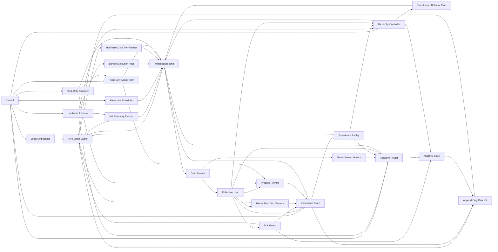

# rust-norion

`rust-norion` is a Rust prototype for a local Noiron-style self-evolving
inference control layer for self-developed Transformer runtimes.

`rust-norion` 是一个用 Rust 编写的本地 Noiron 风格自进化推理控制层原型，默认面向自主训练的
Transformer 运行时。

## Project Goal / 项目目标

The goal is to build a practical, sovereignty-first local inference control
engine that can make a self-developed model backend behave more adaptively over
time without retraining model weights on every interaction.

本项目目标是构建一个实用、自主可控优先的本地推理控制引擎，让自研模型后端在不频繁重训权重的前提下，能够随着使用逐步调整推理策略、记忆选择和计算分配。

The optimized target combines five non-negotiable requirements:

优化后的目标由五个硬约束共同定义：

- self-developed model stack: the default backend is a self-trained
  Transformer-family model, not external weights
- anti lock-in: no closed model service, vendor-only runtime, or opaque
  quantization path in the core engine
- extreme local deployment: offline-first, lightweight, disk-backed memory,
  and ultra-long-context control for consumer or edge hardware
- universal device adaptation: laptops, desktops, workstations, servers,
  phones, tablets, wearable/XR/TV targets, embedded boards, browser-WASM,
  microcontroller-class tiny targets, edge/robot/vehicle devices, NPU/AI
  accelerator devices, and heterogeneous multi-GPU machines should all map into
  explicit hardware profiles that tune latency, KV budgets, routing pressure,
  and hierarchy weights, then into execution plans with portable fallbacks; auto
  probing must emit auditable reason/evidence reports instead of opaque guesses
- frontier algorithms as owned implementations: use public papers as
  inspiration, but implement attention, memory, quantization, routing,
  reflection, and scheduling locally in Rust

- 自研模型栈：默认后端是自主训练的 Transformer 系列模型，而不是外部权重
- 规避卡脖子：核心引擎不绑定闭源模型服务、厂商专用运行时或不透明量化路径
- 极致本地化部署：离线优先、轻量化、磁盘记忆、面向消费级/边缘硬件的超长上下文控制
- 全设备适配：笔记本、台式机、工作站、服务器、手机、平板、可穿戴/XR/TV、嵌入式板卡、浏览器 WASM、微控制器级 tiny 目标、边缘/机器人/车载设备、NPU/AI 加速器设备以及异构多 GPU 机器，都应映射到明确的硬件 profile，用于调整延迟、KV budget、路由压力、层级权重，并生成带可移植降级路径的执行计划
- 全设备探测可审计：自动识别设备时必须输出选择原因、OS/架构/CPU/加速器数量、负载 hint 和脱敏证据，而不是黑盒猜测
- 前沿算法自主实现：公开论文只作为思想来源，注意力、记忆、量化、路由、反思和调度都在 Rust 中本地实现

The project focuses on the control loop around inference:

项目重点不是从零实现完整大模型，而是实现推理外层闭环：

- multi-factor adaptive routing: decide when a token should use projection,
  local-window attention, global attention, or convolutional fusion based on
  entropy, task profile, context length, cache hit rate, latency pressure,
  hardware pressure, and device compute headroom; each task profile keeps its
  own adaptive threshold
- reinforced KV memory: store useful context, fuse similar memories, weaken bad
  memories, and persist local state
- task-aware hierarchy: shift global, local, and convolution-style compute
  weights for coding, writing, general reasoning, or long-document tasks, with
  profile-specific learned weights persisted across runs
- Rust-native Transformer refactor planning: express global, local-window, and
  convolutional-fusion layer plans as explicit Rust data structures
- reflection loop: score drafts, detect weak outputs, revise confidence, and
  decide what should become reusable memory
- backend abstraction: keep the control layer independent from the actual model
  runtime

- 多因子自适应路由：基于熵、任务类型、上下文长度、缓存命中率、延迟压力、硬件压力和设备算力余量，判断 token 应该走投影、局部窗口注意力、全局注意力还是卷积融合，并为不同任务 profile 分别维护自适应阈值
- 强化式 KV 记忆：保存有用上下文，融合相似记忆，削弱错误记忆，并持久化到本地
- 任务感知层级调度：针对代码、写作、通用推理、长文档任务调整全局/局部/卷积式计算权重，并按任务 profile 持久化学习后的权重
- Rust 原生 Transformer 重构规划：用明确的 Rust 数据结构表达全局注意力、局部窗口注意力和卷积融合层计划
- 反思闭环：评估草稿质量，发现薄弱输出，修正置信度，并决定是否写入可复用记忆
- 后端抽象：让控制层与真实模型运行时解耦

## Self-Owned Stack / 自主双栈

`rust-norion` is designed as an Agent Harness and test-time scaling control
plane around a self-owned Transformer runtime:

`rust-norion` 的架构定位是围绕自研 Transformer 运行时的 Agent Harness 与
Test-time Scaling 控制平面：

- model runtime: owns tokenizer, embeddings, weights, native context window,
  forward kernels, and optional KV import/export
- control plane: owns recursive scheduling, adaptive routing, memory tiering,
  sparse context filtering, reflection, RLVR-style process rewards, experience
  replay, and persisted adaptive state
- stable boundary: `ModelRuntime` and `InferenceBackend` keep model iteration
  independent from routing, memory, and reflection iteration

- 模型运行时：负责 tokenizer、embedding、权重、原生上下文窗口、前向计算内核，以及可选的 KV 导入/导出
- 控制平面：负责递归调度、自适应路由、记忆分层、稀疏上下文筛选、反思、RLVR 风格过程奖励、经验回放和持久化自适应状态
- 稳定边界：通过 `ModelRuntime` 和 `InferenceBackend` 让模型迭代与路由、记忆、反思迭代解耦

## Sovereignty Scope / 自主可控范围

The default target is a self-trained Transformer-family model. The core project
does not depend on Gemma, Llama, Qwen, closed model services, or vendor-specific
runtime features. Public papers and open algorithm ideas can guide the design,
but quantization, attention routing, memory scheduling, reflection, and adaptive
state should be implemented as local Rust components.

默认目标是自主训练的 Transformer 系列模型。核心项目不依赖 Gemma、Llama、Qwen、闭源模型服务或厂商绑定运行时能力。可以借鉴公开论文和开放算法思想，但量化、注意力路由、记忆调度、反思闭环和自适应状态都应作为本地 Rust 组件自主实现。

All semantic filtering, gist generation, and memory scoring should prefer the
self-developed model's own tokenizer and embeddings. The project should not add
a second third-party encoder just to make memory retrieval work.

语义筛选、gist 生成和记忆评分优先复用自研模型自身的 tokenizer 与 embedding。项目不应为了记忆检索再引入第二套第三方编码器。

## Local Algorithm Stack / 本地算法栈

The target algorithm stack is model-weight independent:

目标算法栈与具体模型权重解耦：

- ultra-long context: Infini-style global/local KV separation, recursive
  long-context scheduling, hierarchical gist memory, and SpeContext-style
  sparse KV filtering
- lightweight KV system: self-owned 4/8-bit uniform KV quantization,
  reinforced KV-Fusion, time decay, semantic clustering, and Hot/Warm/Cold
  storage
- self-evolution loop: test-time scaling, RLVR-style rewards for control
  decisions, same-inference online reward feedback, reflection scoring, drift
  gates, adaptive rollback, experience replay, and auditable evolution evidence
- Rust Transformer refactor: explicit layer templates for local-window,
  global-memory, and convolutional-fusion compute paths

- 超长上下文：Infini 风格全局/局部 KV 分离、递归长上下文调度、层级 gist 记忆、SpeContext 风格稀疏 KV 筛选
- 轻量 KV 系统：自研 4/8-bit uniform KV 量化、强化式 KV-Fusion、时间衰减、语义聚类和 Hot/Warm/Cold 分层存储
- 自进化闭环：Test-time Scaling、针对控制决策的 RLVR 风格奖励、同轮推理在线奖励反馈、反思评分、漂移门控、自适应回滚、经验回放和可审计进化证据
- Rust Transformer 重构：用显式层模板表达局部窗口、全局记忆、卷积融合等计算路径

## Current Status / 当前状态

This repository currently contains a working control-plane prototype, a
deterministic local Transformer-style runtime prototype, and a
manifest-backed production runtime boundary. It also includes a deterministic
Rust reference production kernel for exercising the boundary end to end, but it
does not yet include a trained production inference kernel.

当前仓库已经包含一个可运行的控制层原型、确定性的本地 Transformer 风格运行时原型，以及基于 manifest 的生产运行时边界；同时提供了一个确定性的 Rust reference production kernel，用来端到端验证生产边界，但还没有接入训练好的生产级推理内核。

Implemented modules:

已实现模块：

- `src/router.rs`: multi-factor adaptive router with task-profile-specific attention thresholds and hardware-aware compute pressure
- `src/adaptive_state.rs`: persisted router, hierarchy, tier-plan control state, memory governance policy, live-inference online reward feedback counters, and cumulative self-evolution ledger for replay-driven router, hierarchy, memory, replay live-feedback consumption, structured live-evolution replay consumption, online reward feedback, recursive-cost mutations, and drift rollback safety audits
- `src/benchmark.rs`: built-in benchmark cases, regression gates, recursive long-context coverage gate, per-device recursive coverage gate, auto-replay router-threshold/hierarchy-weight mutation and memory-update coverage gates, live memory-feedback write and auto-replay consumption gates, live/replay online reward feedback/reinforcement/penalty gates with all-device coverage floors, cumulative evolution-ledger replay live-feedback consumption gates, auto-replay recursive cost-pressure floor/ceiling gates, production/reference runtime forward-signal, forward-energy, KV-influence, KV-import, KV-export, runtime-KV hold, device-adapter-contract, and best-adapter selection gates, KV quantization accuracy/latency gate, and persistent roundtrip reuse gate
- `src/disk_kv.rs`: append-only disk-backed KV store
- `src/drift.rs`: drift guard for memory-write gates, runtime-KV admission, severity-scaled used-memory penalties, and adaptive-state rollback
- `src/infini_memory.rs`: Infini-style global/local memory planner with sparse token-budget filtering and vector-carrying import decisions
- `src/kv_cache.rs`: reinforced KV fusion cache with disk persistence, retention policy, embedding-dimension-aware similarity, and batch semantic compaction for near-duplicate memories
- `src/kv_exchange.rs`: shared runtime KV block type for import/export between Noiron and model runtimes
- `src/kv_quant.rs`: self-owned 4/8-bit uniform KV vector quantization
- `src/local_runtime.rs`: Rust-native self-developed Transformer-style runtime prototype implementing tokenizer, model-side embedding, deterministic global/local/convolution forward layers, imported-KV influence, generation, KV import/export, and device-bounded adapter selection informed by prior runtime diagnostics
- `src/recursive_scheduler.rs`: native-window-aware recursive long-context scheduler with hardware-bounded execution waves
- `src/tiered_cache.rs`: Hot/Warm/Cold memory tier scheduler with migration traces
- `src/token_stream.rs`: generated-token window monitor for router feedback
- `src/toolsmith.rs`: Rust-only local tool blueprint planner that can propose gated helper CLIs, reject non-Rust tool surfaces, and carry build/validation outlines into runtime requests and reward notes
- `src/agent_team.rs`: read-only sub-agent/team blackboard planner with single-writer isolation, conflict summaries, collision-free checks, and bounded evolution hints for the main control loop
- `src/trace.rs`: JSONL trace writer and schema gate for routing, runtime token uncertainty, runtime forward diagnostics, hierarchy, KV, recursion, auto-replay router/hierarchy update counters plus threshold/weight mutation deltas, consumed live memory-feedback counters, live and cumulative online reward feedback counters, cumulative self-evolution ledger counters including replay live-feedback consumption, drift rollback safety counters, memory updates, recursive cost pressure, hardware execution, the stable runtime device contract, runtime device-contract semantic alignment, KV budgets, Toolsmith, Agent Team, reflection diagnostics, drift, reward, memory policy, and memory counters
- `src/experience.rs`: structured reflection experience store with route budget, KV usage traces, persisted runtime diagnostics, persisted runtime token uncertainty metrics, persisted live memory-feedback notes, per-inference live-evolution evidence including online reward feedback, persisted reflection issues, and revision actions
- `src/experience_replay.rs`: reward-ranked experience replay planner that can automatically reinforce or penalize used, stored, gist, and runtime-KV memories by scaling actual KV update strength from reward, runtime-diagnostic, persisted live memory-feedback, structured live-evolution evidence, online reward feedback, reflection-diagnostic, and recursive schedule/runtime-cost signals with reportable router-threshold mutation, hierarchy-weight mutation, memory-update, live-feedback consumption, live-evolution consumption, online reward feedback consumption, recursive call-pressure, and long-context replay coverage
- `src/gist_memory.rs`: hierarchical document/section/paragraph gist memory generator
- `src/hardware.rs`: device-agnostic hardware pressure, best-effort auto probing with auditable `HardwareProbeReport` reason/evidence, device coverage descriptors and aliases, compute allocation, execution-plan selection, a device compatibility gate for CPU-only, integrated GPU, discrete GPU, unified-memory, mobile, embedded, browser-WASM, microcontroller, NPU/AI accelerator, multi-GPU, edge, and server profiles, and a runtime-manifest device gate for current-device execution contracts, adapter intersections, KV prefetch limits, and hot/cold KV precision bounds
- `src/process_reward.rs`: RLVR-style process reward scoring for control decisions, including structured reflection issue penalties, Rust-only Toolsmith gate adjustments, Agent Team collision-free coordination adjustments, and same-inference online feedback signals for adaptive routing/hierarchy updates that are persisted as structured evolution evidence
- `src/transformer.rs`: Rust-native Transformer layer refactor planner with explicit general, coding, writing, and long-context templates
- `src/hierarchy.rs`: task-profile hierarchy controller with profile-specific learned weights
- `src/reflection.rs`: draft reflection, structured issue/severity diagnostics, one-pass low-risk repair, revision actions, and memory admission logic
- `src/runtime.rs`: model runtime adapter contract for real LLM backends, including metadata, explicit Transformer architecture shape, tokenizer, optional model-side embedding, architecture-bounded KV import/export ABI hooks, Infini/SpeContext-filtered KV import candidates, imported KV request delivery for command runtimes, Toolsmith/Agent Team request context, runtime-adapter observations from prior experience, and structured JSON command-runtime request/response wiring
- `src/runtime_manifest.rs`: self-developed Transformer runtime manifest for model metadata, architecture shape, local asset paths, production asset-file validation, KV policy, quantization policy, supported device classes, adapter hints, and observation-aware adapter selection within device bounds
- `src/production_runtime.rs`: manifest-backed production Transformer runtime boundary that hard-gates local assets, architecture shape, device contract, adapter intersection, KV import limits, imported/exported KV block shape/range/finite-value validity, a `ProductionForwardKernel` trait slot for plugging in a real self-developed forward kernel, deterministic reference/local kernel harnesses, and single-device plus all-device conformance gates for ABI validation
- `src/state_inspect.rs`: local state inspection report for memory, experience, runtime diagnostics, persisted runtime token uncertainty, runtime-KV export/hold evidence, reflection diagnostics, persisted live memory-feedback evidence, persisted online reward feedback evidence, adaptive router, hierarchy, tier counts, effective memory policies, persisted memory vector dimensions, and cumulative self-evolution ledger counters including live inference runs, live router/hierarchy mutations, live KV/store/reflection updates, replay live-feedback consumption, live/replay online reward feedback, and router-threshold/hierarchy-weight deltas
- `src/engine.rs`: closed-loop Noiron engine and `InferenceBackend` trait; runtime token entropy/logprob, Rust-only Toolsmith planning, read-only Agent Team planning, and online process-reward feedback feed the generation metrics used by drift, router, hierarchy, process reward, and experience
- `src/main.rs`: CLI demo using `HeuristicBackend`

## Non-Goals / 非目标

This prototype does not claim that KV memory is equivalent to model-weight
training, and it does not claim to be a complete LLM runtime.

本原型不声称 KV 记忆等同于模型权重训练，也不声称自己已经是完整的大模型运行时。

The near-term engineering target is to make the control loop measurable,
testable, and replaceable before connecting a real model backend.

近期工程目标是先让控制闭环可测、可运行、可替换，再接入真实模型后端。

## Run / 运行

```powershell
cargo run -- --profile coding "Build a Rust Noiron inference engine"
```

Trigger recursive long-context scheduling with a small demo native window:

```powershell
cargo run -- --profile long --native-window 8 --chunk-tokens 6 --chunk-overlap 2 --merge-fan-in 2 "one two three four five six seven eight nine ten eleven twelve"
```

Replay high/low reward experience before the next inference:

```powershell
cargo run -- --replay 4 --profile coding "Improve Rust Noiron routing from prior experience"
```

By default, the engine also performs a small automatic replay pass before
inference when prior experience exists and local hardware pressure is not high.
Use `--auto-replay 0` to disable it or `--auto-replay n` to change the limit.

默认情况下，只要已有历史经验且本地硬件压力不高，引擎会在推理前自动执行一次小规模 experience replay。
可以用 `--auto-replay 0` 关闭，或用 `--auto-replay n` 调整上限。

Inspect persisted local state without running inference:

```powershell
cargo run -- --inspect-state --inspect-limit 5
```

The report includes effective memory retention/compaction policy values and a
memory-vector dimension histogram, plus `runtime_kv:` memory counts, runtime
KV vector dimensions, and top persisted runtime KV memories. Top experience
rows also expose persisted runtime model id, adapter, forward energy, KV
influence, hot/cold KV precision, KV import/export counts, exported-but-held
runtime KV block counts, live memory-feedback update counts,
reflection issue counts, critical reflection issue counts, and revision action
counts, so runtime embedding-space changes, fallback/runtime mixing, online
memory feedback, and closed-loop reflection persistence can be audited before
another inference writes more durable state.

Turn the same inspection into a local/CI gate by requiring persisted evidence:

```powershell
cargo run -- --inspect-gate --inspect-min-runtime-kv-memories 1 --inspect-min-experiences 1 --inspect-min-runtime-model-experiences 1 --inspect-min-runtime-adapter-experiences 1 --inspect-min-runtime-forward-energy-experiences 1 --inspect-min-runtime-kv-influence-experiences 1 --inspect-min-runtime-kv-precision-experiences 1 --inspect-max-runtime-kv-precision-mismatches 0 --inspect-min-runtime-kv-import-experiences 1 --inspect-min-runtime-kv-export-experiences 1 --inspect-min-runtime-kv-hold-experiences 1 --inspect-min-runtime-kv-held-blocks 1 --inspect-min-reflection-issue-experiences 1 --inspect-min-critical-reflection-issue-experiences 1 --inspect-min-revision-action-experiences 1 --inspect-min-live-memory-feedback-experiences 1 --inspect-min-live-memory-feedback-updates 1 --inspect-min-evolution-live-inference-runs 1 --inspect-min-evolution-live-router-threshold-delta 0.001 --inspect-min-evolution-live-hierarchy-weight-delta 0.001 --inspect-min-evolution-live-memory-updates 1 --inspect-min-evolution-live-stored-memory-updates 1 --inspect-min-evolution-router-threshold-delta 0.001 --inspect-min-evolution-hierarchy-weight-delta 0.001 --inspect-min-evolution-memory-updates 1 --inspect-min-evolution-replay-live-memory-feedback-updates 1 --inspect-min-evolution-recursive-replay-items 1 --inspect-max-evolution-rollback-router-threshold-delta 0 --inspect-max-evolution-rollback-hierarchy-weight-delta 0 --inspect-require-runtime-kv-dimensions
```

Any `--inspect-min-*` threshold implies `--inspect-state --inspect-gate` and
exits with code `2` when persisted runtime KV, experience, router observations,
runtime diagnostics evidence, live memory feedback, reflection diagnostics evidence, or
self-evolution ledger counters/deltas are missing. Use the
`--inspect-min-evolution-live-*` flags to prove live inference itself persisted
online evolution evidence, including live inference runs, router/hierarchy
mutations and deltas, online reward feedback/reinforcement/penalty counts,
memory feedback updates, stored semantic/gist/runtime-KV memory writes,
reflection issues, critical reflection issues, and revision actions. Use
`--inspect-min-evolution-replay-live-memory-feedback-updates` when replay must
prove it consumed persisted live feedback in the cumulative ledger, use
`--inspect-min-evolution-replay-live-evolution-online-reward-*` when replay must
prove it consumed persisted online reward feedback from live-evolution records,
use
`--inspect-min-evolution-recursive-replay-items` when long-context replay
evidence must also survive in persisted adaptive state, and use the
`--inspect-max-evolution-rollback-*` flags to make drift rollback magnitude a
state-inspection safety cap. Use
`--inspect-max-runtime-adapter-selection-mismatches 0` when persisted adapter
observations must prove the current device still selects the best compatible
adapter after reload. Use `--inspect-min-runtime-kv-precision-experiences` plus
`--inspect-max-runtime-kv-precision-mismatches 0` when persisted runtime
diagnostics must prove their hot/cold KV precision still matches the current
device execution plan. Use `--inspect-min-runtime-uncertainty-experiences`
when reloaded experience records must prove runtime token entropy/logprob or
perplexity evidence reached durable memory rather than only trace or benchmark
output, and add `--inspect-min-runtime-uncertainty-tokens` when the gate must
also prove a minimum volume of persisted entropy/logprob token evidence. Use
`--inspect-min-runtime-kv-hold-experiences` and
`--inspect-min-runtime-kv-held-blocks` when fast-path watch cases must prove the
runtime exported KV but the control plane held part of it out of durable
`runtime_kv:` memory. In all-device mode both mismatch caps are applied to the
summed mismatch counts across all device-scoped state files, and the matrix
summary prints `runtime_adapter_selection_mismatches` and
`runtime_kv_precision_mismatches`.

Add `--benchmark-all-devices` to inspect the same device-scoped state files
created by the all-device roundtrip gate, for example `memory.cpu.ndkv`,
`memory.mobile.ndkv`, and `memory.server.ndkv`:

```powershell
cargo run -- --inspect-state --benchmark-all-devices --memory target/roundtrip-memory.ndkv --experience target/roundtrip-experience.ndkv --adaptive target/roundtrip-adaptive.ndkv --inspect-min-runtime-kv-memories 1 --inspect-min-experiences 1 --inspect-min-runtime-model-experiences 1 --inspect-min-runtime-adapter-experiences 1 --inspect-min-runtime-forward-energy-experiences 1 --inspect-min-runtime-kv-influence-experiences 1 --inspect-min-runtime-uncertainty-experiences 1 --inspect-min-runtime-kv-precision-experiences 1 --inspect-max-runtime-kv-precision-mismatches 0 --inspect-min-runtime-kv-import-experiences 1 --inspect-min-runtime-kv-export-experiences 1 --inspect-min-runtime-kv-hold-experiences 1 --inspect-min-runtime-kv-held-blocks 1 --inspect-min-reflection-issue-experiences 1 --inspect-min-critical-reflection-issue-experiences 1 --inspect-min-revision-action-experiences 1 --inspect-min-live-memory-feedback-experiences 1 --inspect-min-live-memory-feedback-updates 1 --inspect-min-evolution-live-inference-runs 1 --inspect-min-evolution-live-memory-updates 1 --inspect-min-evolution-live-stored-memory-updates 1 --inspect-min-evolution-router-threshold-delta 0.001 --inspect-min-evolution-hierarchy-weight-delta 0.001 --inspect-min-evolution-memory-updates 1 --inspect-min-evolution-replay-live-memory-feedback-updates 1 --inspect-min-evolution-recursive-replay-items 1 --inspect-max-evolution-rollback-router-threshold-delta 0 --inspect-max-evolution-rollback-hierarchy-weight-delta 0 --inspect-require-runtime-kv-dimensions
```

All-device inspection can also require matrix-level runtime and
reflection/revision coverage. Runtime ABI evidence is gated with
`--inspect-min-runtime-kv-memory-device-profiles`,
`--inspect-min-runtime-model-device-profiles`,
`--inspect-min-runtime-adapter-device-profiles`,
`--inspect-min-runtime-forward-energy-device-profiles`,
`--inspect-min-runtime-kv-influence-device-profiles`,
`--inspect-min-runtime-uncertainty-device-profiles`,
`--inspect-min-runtime-uncertainty-token-device-profiles`,
`--inspect-min-runtime-kv-precision-device-profiles`,
`--inspect-min-runtime-kv-import-device-profiles`,
`--inspect-min-runtime-kv-export-device-profiles`, and
`--inspect-min-runtime-kv-hold-device-profiles`. Runtime KV precision
contract drift is capped across the whole matrix with
`--inspect-max-runtime-kv-precision-mismatches`; persisted adapter-selection
drift is capped with `--inspect-max-runtime-adapter-selection-mismatches`.
Closed-loop evidence is
gated with `--inspect-min-reflection-issue-device-profiles`,
`--inspect-min-critical-reflection-issue-device-profiles`, and
`--inspect-min-revision-action-device-profiles`. Persisted live memory feedback
is gated with `--inspect-min-live-memory-feedback-device-profiles`. Persisted live-inference
self-evolution coverage is gated with
`--inspect-min-evolution-live-inference-device-profiles`,
`--inspect-min-evolution-live-router-threshold-mutation-device-profiles`,
`--inspect-min-evolution-live-hierarchy-weight-mutation-device-profiles`,
`--inspect-min-evolution-live-online-reward-device-profiles`,
`--inspect-min-evolution-live-memory-update-device-profiles`,
`--inspect-min-evolution-live-stored-memory-update-device-profiles`,
`--inspect-min-evolution-live-reflection-issue-device-profiles`,
`--inspect-min-evolution-live-critical-reflection-issue-device-profiles`, and
`--inspect-min-evolution-live-revision-action-device-profiles`. Persisted replay
self-evolution ledger evidence is gated with
`--inspect-min-evolution-replay-run-device-profiles`,
`--inspect-min-evolution-replay-item-device-profiles`,
`--inspect-min-evolution-router-threshold-mutation-device-profiles`,
`--inspect-min-evolution-hierarchy-weight-mutation-device-profiles`,
`--inspect-min-evolution-memory-update-device-profiles`,
`--inspect-min-evolution-replay-live-memory-feedback-device-profiles`,
`--inspect-min-evolution-replay-live-evolution-online-reward-device-profiles`,
`--inspect-min-evolution-recursive-replay-device-profiles`, and
`--inspect-min-evolution-recursive-runtime-call-device-profiles`. These flags
imply `--inspect-state --inspect-gate --benchmark-all-devices` and fail when
persisted runtime, reflection, revision, or self-evolution ledger evidence only
exists in a subset of device-scoped state files.

For a single CI smoke gate that writes fresh runtime KV state and immediately
inspects the persisted evidence, combine roundtrip and inspection:

```powershell
cargo run -- --benchmark-roundtrip --inspect-state --benchmark-all-devices --memory target/roundtrip-memory.ndkv --experience target/roundtrip-experience.ndkv --adaptive target/roundtrip-adaptive.ndkv --runtime-kv-exchange --inspect-min-runtime-kv-memories 1 --inspect-min-experiences 1 --inspect-min-runtime-model-experiences 1 --inspect-min-runtime-adapter-experiences 1 --inspect-min-runtime-forward-energy-experiences 1 --inspect-min-runtime-kv-influence-experiences 1 --inspect-min-runtime-kv-precision-experiences 1 --inspect-max-runtime-kv-precision-mismatches 0 --inspect-min-runtime-kv-import-experiences 1 --inspect-min-runtime-kv-export-experiences 1 --inspect-min-reflection-issue-experiences 1 --inspect-min-critical-reflection-issue-experiences 1 --inspect-min-revision-action-experiences 1 --inspect-min-live-memory-feedback-experiences 1 --inspect-min-live-memory-feedback-updates 1 --inspect-min-evolution-live-inference-runs 1 --inspect-min-evolution-live-memory-updates 1 --inspect-min-evolution-live-stored-memory-updates 1 --inspect-min-evolution-router-threshold-delta 0.001 --inspect-min-evolution-hierarchy-weight-delta 0.001 --inspect-min-evolution-memory-updates 1 --inspect-min-evolution-replay-live-memory-feedback-updates 1 --inspect-min-evolution-recursive-replay-items 1 --inspect-max-evolution-rollback-router-threshold-delta 0 --inspect-max-evolution-rollback-hierarchy-weight-delta 0 --inspect-require-runtime-kv-dimensions
```

查看本地持久化状态，但不执行推理：

```powershell
cargo run -- --inspect-state --inspect-limit 5
```

报告会包含实际生效的记忆保留 / 压缩策略，以及持久化 memory vector
维度直方图，同时单独展示 `runtime_kv:` 记忆数量、runtime KV 维度桶和高价值
runtime KV 长期记忆。高价值 experience 行也会展示已持久化的 runtime model id、
adapter、forward energy、KV influence、hot/cold KV precision、KV 导入 / 导出计数、已导出但被 hold 的 runtime KV block 计数、live memory-feedback
更新数量、reflection issue 数量、critical reflection issue 数量和 revision action
数量，便于在继续写入长期状态前检查自研 runtime embedding 空间变化、fallback/runtime
混用、在线记忆反馈或闭环反思是否已经持久化。

同一条检查路径也可以作为本地 / CI 门禁：

```powershell
cargo run -- --inspect-gate --inspect-min-runtime-kv-memories 1 --inspect-min-experiences 1 --inspect-min-runtime-model-experiences 1 --inspect-min-runtime-adapter-experiences 1 --inspect-min-runtime-forward-energy-experiences 1 --inspect-min-runtime-kv-influence-experiences 1 --inspect-min-runtime-kv-precision-experiences 1 --inspect-max-runtime-kv-precision-mismatches 0 --inspect-min-runtime-kv-import-experiences 1 --inspect-min-runtime-kv-export-experiences 1 --inspect-min-runtime-kv-hold-experiences 1 --inspect-min-runtime-kv-held-blocks 1 --inspect-min-reflection-issue-experiences 1 --inspect-min-critical-reflection-issue-experiences 1 --inspect-min-revision-action-experiences 1 --inspect-min-live-memory-feedback-experiences 1 --inspect-min-live-memory-feedback-updates 1 --inspect-min-evolution-live-inference-runs 1 --inspect-min-evolution-live-router-threshold-delta 0.001 --inspect-min-evolution-live-hierarchy-weight-delta 0.001 --inspect-min-evolution-live-memory-updates 1 --inspect-min-evolution-live-stored-memory-updates 1 --inspect-min-evolution-router-threshold-delta 0.001 --inspect-min-evolution-hierarchy-weight-delta 0.001 --inspect-min-evolution-memory-updates 1 --inspect-min-evolution-replay-live-memory-feedback-updates 1 --inspect-min-evolution-recursive-replay-items 1 --inspect-max-evolution-rollback-router-threshold-delta 0 --inspect-max-evolution-rollback-hierarchy-weight-delta 0 --inspect-require-runtime-kv-dimensions
```

任意 `--inspect-min-*` 阈值都会隐式开启 `--inspect-state --inspect-gate`；如果
持久化 runtime KV、experience、runtime diagnostics、live memory feedback、reflection diagnostics、router observation 或自进化 ledger 计数 / delta 证据不足，
进程会用退出码 `2` 失败。需要证明持久化 adapter 观察在 reload 后仍然选择当前设备的最佳兼容 adapter 时，使用
`--inspect-max-runtime-adapter-selection-mismatches 0`；需要证明持久化 runtime diagnostics 的 hot/cold KV precision 仍然符合当前设备执行计划时，使用
`--inspect-min-runtime-kv-precision-experiences` 搭配
`--inspect-max-runtime-kv-precision-mismatches 0`。
需要证明 runtime token entropy/logprob/perplexity 已经写入持久化 experience，
而不是只出现在 trace 或 benchmark 输出时，使用
`--inspect-min-runtime-uncertainty-experiences`；如果还必须证明持久化的
entropy/logprob token 证据数量达到最低值，继续加
`--inspect-min-runtime-uncertainty-tokens`。
需要证明 fast-path watch 场景里 runtime 已导出 KV、但控制层把其中一部分拦截在长期
`runtime_kv:` 记忆之外时，使用 `--inspect-min-runtime-kv-hold-experiences`
和 `--inspect-min-runtime-kv-held-blocks`。
使用 `--inspect-min-evolution-live-*` 可以要求在线推理本身已经把自进化证据持久化下来，包括 live inference 次数、router / hierarchy 变更和 delta、online reward feedback / reinforcement / penalty 计数、记忆反馈更新、semantic/gist/runtime-KV 写入、reflection issue、critical reflection issue 和 revision action。
使用 `--inspect-min-evolution-replay-live-evolution-online-reward-*` 可以要求 replay 已经消费过 live-evolution 记录里的在线奖励反馈。

加上 `--benchmark-all-devices` 后，会检查 all-device roundtrip 门禁写出的同一组
device-scoped 状态文件，例如 `memory.cpu.ndkv`、`memory.mobile.ndkv` 和
`memory.server.ndkv`：

```powershell
cargo run -- --inspect-state --benchmark-all-devices --memory target/roundtrip-memory.ndkv --experience target/roundtrip-experience.ndkv --adaptive target/roundtrip-adaptive.ndkv --inspect-min-runtime-kv-memories 1 --inspect-min-experiences 1 --inspect-min-runtime-model-experiences 1 --inspect-min-runtime-adapter-experiences 1 --inspect-min-runtime-forward-energy-experiences 1 --inspect-min-runtime-kv-influence-experiences 1 --inspect-min-runtime-uncertainty-experiences 1 --inspect-min-runtime-kv-precision-experiences 1 --inspect-max-runtime-kv-precision-mismatches 0 --inspect-min-runtime-kv-import-experiences 1 --inspect-min-runtime-kv-export-experiences 1 --inspect-min-runtime-kv-hold-experiences 1 --inspect-min-runtime-kv-held-blocks 1 --inspect-min-reflection-issue-experiences 1 --inspect-min-critical-reflection-issue-experiences 1 --inspect-min-revision-action-experiences 1 --inspect-min-live-memory-feedback-experiences 1 --inspect-min-live-memory-feedback-updates 1 --inspect-min-evolution-live-inference-runs 1 --inspect-min-evolution-live-memory-updates 1 --inspect-min-evolution-live-stored-memory-updates 1 --inspect-min-evolution-router-threshold-delta 0.001 --inspect-min-evolution-hierarchy-weight-delta 0.001 --inspect-min-evolution-memory-updates 1 --inspect-min-evolution-replay-live-memory-feedback-updates 1 --inspect-min-evolution-recursive-replay-items 1 --inspect-max-evolution-rollback-router-threshold-delta 0 --inspect-max-evolution-rollback-hierarchy-weight-delta 0 --inspect-require-runtime-kv-dimensions
```

全设备 inspection 还可以要求矩阵级 runtime 与反思 / 修订覆盖。runtime ABI
证据通过 `--inspect-min-runtime-kv-memory-device-profiles`、
`--inspect-min-runtime-model-device-profiles`、
`--inspect-min-runtime-adapter-device-profiles`、
`--inspect-min-runtime-forward-energy-device-profiles`、
`--inspect-min-runtime-kv-influence-device-profiles`、
`--inspect-min-runtime-uncertainty-device-profiles`、
`--inspect-min-runtime-uncertainty-token-device-profiles`、
`--inspect-min-runtime-kv-import-device-profiles` 和
`--inspect-min-runtime-kv-export-device-profiles`、
`--inspect-min-runtime-kv-hold-device-profiles` 门禁；runtime KV precision
漂移通过 `--inspect-max-runtime-kv-precision-mismatches` 控制，持久化
adapter 选择漂移通过 `--inspect-max-runtime-adapter-selection-mismatches`
控制；闭环证据通过
`--inspect-min-reflection-issue-device-profiles`、
`--inspect-min-critical-reflection-issue-device-profiles` 和
`--inspect-min-revision-action-device-profiles` 门禁；持久化 live memory feedback
通过 `--inspect-min-live-memory-feedback-device-profiles` 门禁；持久化在线推理自进化覆盖通过
`--inspect-min-evolution-live-inference-device-profiles`、
`--inspect-min-evolution-live-router-threshold-mutation-device-profiles`、
`--inspect-min-evolution-live-hierarchy-weight-mutation-device-profiles`、
`--inspect-min-evolution-live-online-reward-device-profiles`、
`--inspect-min-evolution-live-memory-update-device-profiles`、
`--inspect-min-evolution-live-stored-memory-update-device-profiles`、
`--inspect-min-evolution-live-reflection-issue-device-profiles`、
`--inspect-min-evolution-live-critical-reflection-issue-device-profiles` 和
`--inspect-min-evolution-live-revision-action-device-profiles` 门禁；持久化 replay 自进化 ledger 证据通过
`--inspect-min-evolution-replay-run-device-profiles`、
`--inspect-min-evolution-replay-item-device-profiles`、
`--inspect-min-evolution-router-threshold-mutation-device-profiles`、
`--inspect-min-evolution-hierarchy-weight-mutation-device-profiles`、
`--inspect-min-evolution-memory-update-device-profiles`、
`--inspect-min-evolution-replay-live-memory-feedback-device-profiles`、
`--inspect-min-evolution-replay-live-evolution-online-reward-device-profiles`、
`--inspect-min-evolution-recursive-replay-device-profiles` 和
`--inspect-min-evolution-recursive-runtime-call-device-profiles` 门禁。这些参数会隐式开启
`--inspect-state --inspect-gate --benchmark-all-devices`；如果持久化 runtime、
reflection、revision 或 self-evolution ledger 证据只存在于部分 device-scoped
状态文件中，门禁会失败。

如果希望一条 CI 命令先写入新的 runtime KV 状态，再立刻检查持久化证据，可以组合
roundtrip 和 inspection：

```powershell
cargo run -- --benchmark-roundtrip --inspect-state --benchmark-all-devices --memory target/roundtrip-memory.ndkv --experience target/roundtrip-experience.ndkv --adaptive target/roundtrip-adaptive.ndkv --runtime-kv-exchange --inspect-min-runtime-kv-memories 1 --inspect-min-experiences 1 --inspect-min-runtime-model-experiences 1 --inspect-min-runtime-adapter-experiences 1 --inspect-min-runtime-forward-energy-experiences 1 --inspect-min-runtime-kv-influence-experiences 1 --inspect-min-runtime-kv-precision-experiences 1 --inspect-max-runtime-kv-precision-mismatches 0 --inspect-min-runtime-kv-import-experiences 1 --inspect-min-runtime-kv-export-experiences 1 --inspect-min-reflection-issue-experiences 1 --inspect-min-critical-reflection-issue-experiences 1 --inspect-min-revision-action-experiences 1 --inspect-min-live-memory-feedback-experiences 1 --inspect-min-live-memory-feedback-updates 1 --inspect-min-evolution-live-inference-runs 1 --inspect-min-evolution-live-memory-updates 1 --inspect-min-evolution-live-stored-memory-updates 1 --inspect-min-evolution-router-threshold-delta 0.001 --inspect-min-evolution-hierarchy-weight-delta 0.001 --inspect-min-evolution-memory-updates 1 --inspect-min-evolution-replay-live-memory-feedback-updates 1 --inspect-min-evolution-recursive-replay-items 1 --inspect-max-evolution-rollback-router-threshold-delta 0 --inspect-max-evolution-rollback-hierarchy-weight-delta 0 --inspect-require-runtime-kv-dimensions
```

Write one structured JSONL trace record for benchmark comparison:

```powershell
cargo run -- --trace target/noiron-trace.jsonl --profile coding "Trace Rust Noiron routing and memory decisions"
```

Run the built-in benchmark suite and append one JSONL trace record per case:

```powershell
cargo run -- --benchmark target/noiron-benchmark.jsonl
```

Run the same suite as a regression gate:

```powershell
cargo run -- --benchmark target/noiron-benchmark.jsonl --benchmark-gate --benchmark-min-quality 0.6 --benchmark-min-reward 0.5 --benchmark-max-drift-blocks 0 --benchmark-max-drift-rollbacks 0
```

Benchmark runs seed deterministic local sparse-memory fixtures before the
cases execute, so `--benchmark-min-sparse-skipped-cases` and
`--benchmark-min-sparse-skipped-tokens` can validate Infini/SpeContext filtering
from a clean state:

```powershell
cargo run -- --benchmark target/noiron-sparse-benchmark.jsonl --benchmark-gate --benchmark-min-sparse-skipped-cases 1 --benchmark-min-sparse-skipped-tokens 1 --benchmark-max-drift-blocks 0 --benchmark-max-drift-rollbacks 0
```

benchmark 会在执行 case 前注入确定性的本地稀疏记忆 fixture，因此即使使用全新的
memory / experience / adaptive 文件，也可以用 `--benchmark-min-sparse-skipped-cases`
和 `--benchmark-min-sparse-skipped-tokens` 检查 Infini/SpeContext 过滤没有退化：

```powershell
cargo run -- --benchmark target/noiron-sparse-benchmark.jsonl --benchmark-gate --benchmark-min-sparse-skipped-cases 1 --benchmark-min-sparse-skipped-tokens 1 --benchmark-max-drift-blocks 0 --benchmark-max-drift-rollbacks 0
```

Benchmark runs also seed deterministic replay experience, so the suite can
prove that auto-replay updates the router, hierarchy, and memory control plane
and that the cumulative self-evolution ledger records live inference evolution,
mutation, and replay consumption of persisted live feedback:

```powershell
cargo run -- --benchmark target/noiron-replay-control.jsonl --benchmark-gate --benchmark-min-auto-replay-router-updates 1 --benchmark-min-auto-replay-hierarchy-updates 1 --benchmark-min-auto-replay-router-threshold-mutations 1 --benchmark-min-auto-replay-hierarchy-weight-mutations 1 --benchmark-min-auto-replay-router-threshold-delta 0.001 --benchmark-min-auto-replay-hierarchy-weight-delta 0.001 --benchmark-min-auto-replay-memory-updates 1 --benchmark-min-live-memory-feedback-updates 1 --benchmark-min-auto-replay-live-memory-feedback-updates 1 --benchmark-min-evolution-live-inference-runs 1 --benchmark-min-evolution-live-memory-updates 1 --benchmark-min-evolution-live-stored-memory-updates 1 --benchmark-min-evolution-replay-runs 1 --benchmark-min-evolution-replay-items 1 --benchmark-min-evolution-router-threshold-mutations 1 --benchmark-min-evolution-hierarchy-weight-mutations 1 --benchmark-min-evolution-router-threshold-delta 0.001 --benchmark-min-evolution-hierarchy-weight-delta 0.001 --benchmark-min-evolution-memory-updates 1 --benchmark-min-evolution-replay-live-memory-feedback-updates 1 --benchmark-max-drift-blocks 0 --benchmark-max-drift-rollbacks 0
```

benchmark 也会注入确定性的 replay experience，因此可以要求 auto-replay
真实改变 router threshold、hierarchy weights 和 memory 控制面，并要求累计 self-evolution ledger
保留在线推理自进化、这次变化和 replay 对持久化 live feedback 的消费，而不是只记录发生过回放：

```powershell
cargo run -- --benchmark target/noiron-replay-control.jsonl --benchmark-gate --benchmark-min-auto-replay-router-updates 1 --benchmark-min-auto-replay-hierarchy-updates 1 --benchmark-min-auto-replay-router-threshold-mutations 1 --benchmark-min-auto-replay-hierarchy-weight-mutations 1 --benchmark-min-auto-replay-router-threshold-delta 0.001 --benchmark-min-auto-replay-hierarchy-weight-delta 0.001 --benchmark-min-auto-replay-memory-updates 1 --benchmark-min-live-memory-feedback-updates 1 --benchmark-min-auto-replay-live-memory-feedback-updates 1 --benchmark-min-evolution-live-inference-runs 1 --benchmark-min-evolution-live-memory-updates 1 --benchmark-min-evolution-live-stored-memory-updates 1 --benchmark-min-evolution-replay-runs 1 --benchmark-min-evolution-replay-items 1 --benchmark-min-evolution-router-threshold-mutations 1 --benchmark-min-evolution-hierarchy-weight-mutations 1 --benchmark-min-evolution-router-threshold-delta 0.001 --benchmark-min-evolution-hierarchy-weight-delta 0.001 --benchmark-min-evolution-memory-updates 1 --benchmark-min-evolution-replay-live-memory-feedback-updates 1 --benchmark-max-drift-blocks 0 --benchmark-max-drift-rollbacks 0
```

Run the same benchmark cases across every built-in explicit device profile
when device adaptation must be proven by actual control-loop execution, not
only by the device matrix or manifest compatibility gate:

```powershell
cargo run -- --benchmark target/noiron-all-devices.jsonl --benchmark-all-devices --trace-schema-gate target/noiron-all-devices.jsonl --benchmark-gate --benchmark-min-device-profiles 12 --benchmark-max-drift-blocks 0 --benchmark-max-drift-rollbacks 0
```

如果要证明“所有设备都能实际跑过控制闭环”，而不只是设备矩阵或 manifest
契约检查通过，可以让默认 benchmark cases 扫过每一个内置显式设备 profile：

```powershell
cargo run -- --benchmark target/noiron-all-devices.jsonl --benchmark-all-devices --trace-schema-gate target/noiron-all-devices.jsonl --benchmark-gate --benchmark-min-device-profiles 12 --benchmark-max-drift-blocks 0 --benchmark-max-drift-rollbacks 0
```

Require every explicit device profile to exercise a real recursive
long-context schedule by combining the all-device sweep with a constrained demo
native window:

```powershell
cargo run -- --benchmark target/noiron-all-devices-recursive.jsonl --benchmark-all-devices --trace-schema-gate target/noiron-all-devices-recursive.jsonl --benchmark-gate --benchmark-min-device-profiles 12 --benchmark-min-recursive-device-profiles 12 --benchmark-min-recursive-cases 12 --native-window 64 --chunk-tokens 32 --chunk-overlap 8 --benchmark-max-drift-blocks 0 --benchmark-max-drift-rollbacks 0
```

如果要证明“所有设备都不只是跑过短路径，也都真实触发过超长上下文递归调度”，
可以把全设备 benchmark 与递归设备覆盖门禁放在同一次检查里：

```powershell
cargo run -- --benchmark target/noiron-all-devices-recursive.jsonl --benchmark-all-devices --trace-schema-gate target/noiron-all-devices-recursive.jsonl --benchmark-gate --benchmark-min-device-profiles 12 --benchmark-min-recursive-device-profiles 12 --benchmark-min-recursive-cases 12 --native-window 64 --chunk-tokens 32 --chunk-overlap 8 --benchmark-max-drift-blocks 0 --benchmark-max-drift-rollbacks 0
```

Validate an existing trace JSONL file against the required local control-plane
schema fields, including runtime token uncertainty, the stable
`runtime_device_contract`, cumulative `evolution_ledger` counters, and
device-derived hardware KV budgets. The gate also checks that the emitted
hardware device, execution lanes, KV budgets, adapter hints, and selected
runtime adapter agree with the single-line runtime device contract. Runtime
adapter observations are schema-checked as well: a positive observation count
must carry a bounded best score/reward/quality, an experience id, and a best
adapter allowed by the current device contract. The same observation block also
emits `selection_mismatch`, and the schema gate verifies that this flag matches
the trace's `best_adapter` versus `runtime_diagnostics.selected_adapter`
comparison:

```powershell
cargo run -- --trace-schema-gate target/noiron-benchmark.jsonl
```

检查已有 trace JSONL 是否仍包含本地控制平面要求的核心字段，包括 runtime token 不确定性、稳定的 `runtime_device_contract`、累计 `evolution_ledger` 计数与设备推导出的硬件 KV budget。门禁还会检查 trace 里的设备、执行通道、KV budget、adapter hints 和实际 selected runtime adapter 是否与单行 runtime device contract 一致。runtime adapter observation 也会做语义检查：只要 observation count 为正，就必须带有有界 best score/reward/quality、experience id，并且 best adapter 必须被当前设备契约允许。同一个 observation block 还会输出 `selection_mismatch`，schema gate 会校验它是否真实反映 `best_adapter` 与 `runtime_diagnostics.selected_adapter` 的对比结果：

```powershell
cargo run -- --trace-schema-gate target/noiron-benchmark.jsonl
```

You can also combine it with `--trace` or `--benchmark` so the generated JSONL
is checked in the same run.

也可以和 `--trace` 或 `--benchmark` 放在同一次命令里，生成后立刻检查。

Require the benchmark suite to prove at least one real recursive long-context
case by constraining the demo native window:

```powershell
cargo run -- --benchmark target/noiron-recursive-benchmark.jsonl --benchmark-gate --benchmark-min-quality 0.6 --benchmark-min-reward 0.5 --benchmark-min-recursive-cases 1 --native-window 64 --chunk-tokens 32 --chunk-overlap 8 --benchmark-max-drift-blocks 0 --benchmark-max-drift-rollbacks 0
```

通过缩小演示用原生窗口，要求 benchmark 至少有一个真实触发递归长上下文调度的 case：

```powershell
cargo run -- --benchmark target/noiron-recursive-benchmark.jsonl --benchmark-gate --benchmark-min-quality 0.6 --benchmark-min-reward 0.5 --benchmark-min-recursive-cases 1 --native-window 64 --chunk-tokens 32 --chunk-overlap 8 --benchmark-max-drift-blocks 0 --benchmark-max-drift-rollbacks 0
```

For local runtime benchmarks, use `--runtime-native-window` to constrain the
runtime-reported model window and require actual recursive backend calls:

```powershell
cargo run -- --local-runtime --benchmark target/noiron-recursive-runtime.jsonl --benchmark-gate --benchmark-min-recursive-cases 1 --benchmark-min-recursive-runtime-calls 4 --runtime-native-window 64 --chunk-tokens 32 --chunk-overlap 8
```

本地 runtime benchmark 需要用 `--runtime-native-window` 压低 runtime 上报的模型窗口，并可用
`--benchmark-min-recursive-runtime-calls` 要求真实发生多次递归 backend 调用：

```powershell
cargo run -- --local-runtime --benchmark target/noiron-recursive-runtime.jsonl --benchmark-gate --benchmark-min-recursive-cases 1 --benchmark-min-recursive-runtime-calls 4 --runtime-native-window 64 --chunk-tokens 32 --chunk-overlap 8
```

Run the benchmark suite through the manifest-backed production boundary with
the deterministic reference kernel, then require runtime forward diagnostics
including forward energy and KV influence, runtime token uncertainty, runtime
hot/cold KV precision, runtime KV export, and trace schema validity in the
same check:

```powershell
cargo run -- --production-reference-kernel --benchmark target/noiron-production-reference.jsonl --trace-schema-gate target/noiron-production-reference.jsonl --benchmark-gate --benchmark-min-runtime-forward-cases 4 --benchmark-min-runtime-forward-energy-cases 4 --benchmark-min-runtime-kv-influence-cases 4 --benchmark-min-runtime-kv-precision-cases 4 --benchmark-min-runtime-uncertainty-cases 4 --benchmark-min-runtime-uncertainty-tokens 4 --benchmark-min-runtime-kv-exported 4 --runtime-model-id noiron-dev-transformer --runtime-tokenizer noiron-bpe --runtime-native-window 32768 --runtime-embedding-dims 4096 --runtime-layers 32 --runtime-hidden-size 4096 --runtime-attention-heads 32 --runtime-kv-heads 8 --runtime-local-window 8192 --runtime-kv-exchange --runtime-weights ./models/noiron/weights.noiron --runtime-tokenizer-path ./models/noiron/tokenizer.noiron --device cpu
```

通过 manifest-backed 生产边界和确定性 reference kernel 跑完整 benchmark，并在同一次检查里要求 runtime forward diagnostics 中的 forward energy / KV influence、hot/cold KV precision、runtime token uncertainty、runtime KV export 和 trace schema 都有效：

```powershell
cargo run -- --production-reference-kernel --benchmark target/noiron-production-reference.jsonl --trace-schema-gate target/noiron-production-reference.jsonl --benchmark-gate --benchmark-min-runtime-forward-cases 4 --benchmark-min-runtime-forward-energy-cases 4 --benchmark-min-runtime-kv-influence-cases 4 --benchmark-min-runtime-kv-precision-cases 4 --benchmark-min-runtime-uncertainty-cases 4 --benchmark-min-runtime-uncertainty-tokens 4 --benchmark-min-runtime-kv-exported 4 --runtime-model-id noiron-dev-transformer --runtime-tokenizer noiron-bpe --runtime-native-window 32768 --runtime-embedding-dims 4096 --runtime-layers 32 --runtime-hidden-size 4096 --runtime-attention-heads 32 --runtime-kv-heads 8 --runtime-local-window 8192 --runtime-kv-exchange --runtime-weights ./models/noiron/weights.noiron --runtime-tokenizer-path ./models/noiron/tokenizer.noiron --device cpu
```

When production runtime benchmarking is combined with `--benchmark-all-devices`,
the CLI rebuilds the manifest-backed runtime for each explicit device profile.
This makes the selected adapter, runtime device contract, KV prefetch/precision
limits, recursive parallelism budget, and trace hardware block match the current
device instead of reusing a single CPU runtime across the sweep. A full
reference-kernel gate can require all 48 default case/device pairs to produce
runtime forward diagnostics with forward energy and KV influence, runtime
hot/cold KV precision across every device profile, runtime token uncertainty,
token-backed entropy/logprob uncertainty across every device profile,
imported KV, exported KV, at least one admitted runtime KV memory write,
selected adapters that satisfy the device contract,
runtime adapter diversity across the device matrix, runtime adapter
observations with a positive best score from persisted experience, and cumulative
evolution-ledger mutation evidence while all 12 device profiles also trigger
recursive long-context scheduling:

```powershell
cargo run -- --production-reference-kernel --benchmark target/noiron-production-all-devices-recursive.jsonl --benchmark-all-devices --trace-schema-gate target/noiron-production-all-devices-recursive.jsonl --benchmark-gate --benchmark-min-quality 0.45 --benchmark-min-reward 0.30 --benchmark-min-device-profiles 12 --benchmark-min-recursive-device-profiles 12 --benchmark-min-recursive-cases 12 --benchmark-min-runtime-forward-cases 48 --benchmark-min-runtime-forward-energy-cases 48 --benchmark-min-runtime-kv-influence-cases 48 --benchmark-min-runtime-kv-precision-cases 48 --benchmark-min-runtime-kv-precision-device-profiles 12 --benchmark-min-runtime-uncertainty-cases 48 --benchmark-min-runtime-uncertainty-tokens 48 --benchmark-min-runtime-uncertainty-device-profiles 12 --benchmark-min-runtime-uncertainty-token-device-profiles 12 --benchmark-min-runtime-kv-import-cases 48 --benchmark-min-runtime-kv-imported 48 --benchmark-min-runtime-kv-exported 48 --benchmark-min-runtime-kv-stored 1 --benchmark-min-runtime-adapter-contract-cases 48 --benchmark-min-runtime-adapter-kinds 6 --benchmark-min-runtime-adapter-observations 1 --benchmark-min-runtime-adapter-best-score 0.05 --benchmark-max-runtime-adapter-contract-violations 0 --benchmark-min-auto-replay-router-threshold-mutations 1 --benchmark-min-auto-replay-hierarchy-weight-mutations 1 --benchmark-min-auto-replay-router-threshold-delta 0.001 --benchmark-min-auto-replay-hierarchy-weight-delta 0.001 --benchmark-min-auto-replay-memory-updates 1 --benchmark-min-evolution-replay-runs 1 --benchmark-min-evolution-replay-items 1 --benchmark-min-evolution-router-threshold-mutations 1 --benchmark-min-evolution-hierarchy-weight-mutations 1 --benchmark-min-evolution-router-threshold-delta 0.001 --benchmark-min-evolution-hierarchy-weight-delta 0.001 --benchmark-min-evolution-memory-updates 1 --benchmark-min-evolution-recursive-replay-items 1 --benchmark-min-evolution-recursive-runtime-calls 1 --benchmark-max-drift-blocks 0 --benchmark-max-drift-rollbacks 0 --runtime-model-id noiron-dev-transformer --runtime-tokenizer noiron-bpe --runtime-native-window 64 --runtime-embedding-dims 64 --runtime-layers 6 --runtime-hidden-size 64 --runtime-attention-heads 4 --runtime-kv-heads 2 --runtime-local-window 32 --runtime-kv-exchange --runtime-weights ./models/noiron/weights.noiron --runtime-tokenizer-path ./models/noiron/tokenizer.noiron --chunk-tokens 32 --chunk-overlap 8
```

Use the same gate with `--production-local-kernel` when the Rust-native
`LocalTransformerRuntime` prototype itself must pass the production boundary,
KV exchange, all-device contracts, and recursive long-context schedule:

```powershell
cargo run -- --production-local-kernel --benchmark target/noiron-production-local-all-devices-recursive.jsonl --benchmark-all-devices --trace-schema-gate target/noiron-production-local-all-devices-recursive.jsonl --benchmark-gate --benchmark-min-quality 0.45 --benchmark-min-reward 0.30 --benchmark-min-device-profiles 12 --benchmark-min-recursive-device-profiles 12 --benchmark-min-recursive-cases 12 --benchmark-min-runtime-forward-cases 48 --benchmark-min-runtime-forward-energy-cases 48 --benchmark-min-runtime-kv-influence-cases 48 --benchmark-min-runtime-kv-precision-cases 48 --benchmark-min-runtime-kv-precision-device-profiles 12 --benchmark-min-runtime-uncertainty-cases 48 --benchmark-min-runtime-uncertainty-tokens 48 --benchmark-min-runtime-uncertainty-device-profiles 12 --benchmark-min-runtime-uncertainty-token-device-profiles 12 --benchmark-min-runtime-kv-import-cases 48 --benchmark-min-runtime-kv-imported 48 --benchmark-min-runtime-kv-exported 48 --benchmark-min-runtime-kv-stored 1 --benchmark-min-runtime-adapter-contract-cases 48 --benchmark-min-runtime-adapter-kinds 1 --benchmark-min-runtime-adapter-observations 1 --benchmark-min-runtime-adapter-best-score 0.05 --benchmark-max-runtime-adapter-contract-violations 0 --benchmark-min-auto-replay-router-threshold-mutations 1 --benchmark-min-auto-replay-hierarchy-weight-mutations 1 --benchmark-min-auto-replay-router-threshold-delta 0.001 --benchmark-min-auto-replay-hierarchy-weight-delta 0.001 --benchmark-min-auto-replay-memory-updates 1 --benchmark-min-evolution-replay-runs 1 --benchmark-min-evolution-replay-items 1 --benchmark-min-evolution-router-threshold-mutations 1 --benchmark-min-evolution-hierarchy-weight-mutations 1 --benchmark-min-evolution-router-threshold-delta 0.001 --benchmark-min-evolution-hierarchy-weight-delta 0.001 --benchmark-min-evolution-memory-updates 1 --benchmark-min-evolution-recursive-replay-items 1 --benchmark-min-evolution-recursive-runtime-calls 1 --benchmark-max-drift-blocks 0 --benchmark-max-drift-rollbacks 0 --runtime-model-id noiron-dev-transformer --runtime-tokenizer noiron-bpe --runtime-native-window 64 --runtime-embedding-dims 64 --runtime-layers 6 --runtime-hidden-size 64 --runtime-attention-heads 4 --runtime-kv-heads 2 --runtime-local-window 32 --runtime-kv-exchange --runtime-weights ./models/noiron/weights.noiron --runtime-tokenizer-path ./models/noiron/tokenizer.noiron --chunk-tokens 32 --chunk-overlap 8
```

当 production runtime benchmark 和 `--benchmark-all-devices` 同时启用时，CLI
会为每一个显式设备 profile 重新构造 manifest-backed runtime。这样选中的
adapter、runtime device contract、KV 预取/精度限制、递归并行预算和 trace
里的 hardware block 都会跟随当前设备，而不是整轮复用一个 CPU runtime。可以用
reference kernel 先跑完整门禁，要求 48 个默认 case/device 组合都有 runtime
forward diagnostics 里的 forward energy / KV influence、hot/cold KV precision、runtime token uncertainty、跨全部设备的 token 级 entropy/logprob 证据、导入 KV、导出 KV 和至少一次 runtime KV 长期记忆写入，并证明不同设备实际选择了多种 runtime adapter，历史经验产生了带正向 best score 的 runtime adapter observation，同时 12 个设备 profile 都真实触发递归长上下文调度，并且 auto-replay 至少产生一次 router threshold、hierarchy weight、memory update 和累计 evolution ledger 的实际证据：

```powershell
cargo run -- --production-reference-kernel --benchmark target/noiron-production-all-devices-recursive.jsonl --benchmark-all-devices --trace-schema-gate target/noiron-production-all-devices-recursive.jsonl --benchmark-gate --benchmark-min-quality 0.45 --benchmark-min-reward 0.30 --benchmark-min-device-profiles 12 --benchmark-min-recursive-device-profiles 12 --benchmark-min-recursive-cases 12 --benchmark-min-runtime-forward-cases 48 --benchmark-min-runtime-forward-energy-cases 48 --benchmark-min-runtime-kv-influence-cases 48 --benchmark-min-runtime-kv-precision-cases 48 --benchmark-min-runtime-kv-precision-device-profiles 12 --benchmark-min-runtime-uncertainty-cases 48 --benchmark-min-runtime-uncertainty-tokens 48 --benchmark-min-runtime-uncertainty-device-profiles 12 --benchmark-min-runtime-uncertainty-token-device-profiles 12 --benchmark-min-runtime-kv-import-cases 48 --benchmark-min-runtime-kv-imported 48 --benchmark-min-runtime-kv-exported 48 --benchmark-min-runtime-kv-stored 1 --benchmark-min-runtime-adapter-contract-cases 48 --benchmark-min-runtime-adapter-kinds 6 --benchmark-min-runtime-adapter-observations 1 --benchmark-min-runtime-adapter-best-score 0.05 --benchmark-max-runtime-adapter-contract-violations 0 --benchmark-min-auto-replay-router-threshold-mutations 1 --benchmark-min-auto-replay-hierarchy-weight-mutations 1 --benchmark-min-auto-replay-router-threshold-delta 0.001 --benchmark-min-auto-replay-hierarchy-weight-delta 0.001 --benchmark-min-auto-replay-memory-updates 1 --benchmark-min-evolution-replay-runs 1 --benchmark-min-evolution-replay-items 1 --benchmark-min-evolution-router-threshold-mutations 1 --benchmark-min-evolution-hierarchy-weight-mutations 1 --benchmark-min-evolution-router-threshold-delta 0.001 --benchmark-min-evolution-hierarchy-weight-delta 0.001 --benchmark-min-evolution-memory-updates 1 --benchmark-min-evolution-recursive-replay-items 1 --benchmark-min-evolution-recursive-runtime-calls 1 --benchmark-max-drift-blocks 0 --benchmark-max-drift-rollbacks 0 --runtime-model-id noiron-dev-transformer --runtime-tokenizer noiron-bpe --runtime-native-window 64 --runtime-embedding-dims 64 --runtime-layers 6 --runtime-hidden-size 64 --runtime-attention-heads 4 --runtime-kv-heads 2 --runtime-local-window 32 --runtime-kv-exchange --runtime-weights ./models/noiron/weights.noiron --runtime-tokenizer-path ./models/noiron/tokenizer.noiron --chunk-tokens 32 --chunk-overlap 8
```

如果要验证 Rust-native `LocalTransformerRuntime` 原型本身已经能穿过生产边界、
KV 交换、全设备契约和递归长上下文调度，可以把同一套门禁切到
`--production-local-kernel`：

```powershell
cargo run -- --production-local-kernel --benchmark target/noiron-production-local-all-devices-recursive.jsonl --benchmark-all-devices --trace-schema-gate target/noiron-production-local-all-devices-recursive.jsonl --benchmark-gate --benchmark-min-quality 0.45 --benchmark-min-reward 0.30 --benchmark-min-device-profiles 12 --benchmark-min-recursive-device-profiles 12 --benchmark-min-recursive-cases 12 --benchmark-min-runtime-forward-cases 48 --benchmark-min-runtime-forward-energy-cases 48 --benchmark-min-runtime-kv-influence-cases 48 --benchmark-min-runtime-kv-precision-cases 48 --benchmark-min-runtime-kv-precision-device-profiles 12 --benchmark-min-runtime-uncertainty-cases 48 --benchmark-min-runtime-uncertainty-tokens 48 --benchmark-min-runtime-uncertainty-device-profiles 12 --benchmark-min-runtime-uncertainty-token-device-profiles 12 --benchmark-min-runtime-kv-import-cases 48 --benchmark-min-runtime-kv-imported 48 --benchmark-min-runtime-kv-exported 48 --benchmark-min-runtime-kv-stored 1 --benchmark-min-runtime-adapter-contract-cases 48 --benchmark-min-runtime-adapter-kinds 1 --benchmark-min-runtime-adapter-observations 1 --benchmark-min-runtime-adapter-best-score 0.05 --benchmark-max-runtime-adapter-contract-violations 0 --benchmark-min-auto-replay-router-threshold-mutations 1 --benchmark-min-auto-replay-hierarchy-weight-mutations 1 --benchmark-min-auto-replay-router-threshold-delta 0.001 --benchmark-min-auto-replay-hierarchy-weight-delta 0.001 --benchmark-min-auto-replay-memory-updates 1 --benchmark-min-evolution-replay-runs 1 --benchmark-min-evolution-replay-items 1 --benchmark-min-evolution-router-threshold-mutations 1 --benchmark-min-evolution-hierarchy-weight-mutations 1 --benchmark-min-evolution-router-threshold-delta 0.001 --benchmark-min-evolution-hierarchy-weight-delta 0.001 --benchmark-min-evolution-memory-updates 1 --benchmark-min-evolution-recursive-replay-items 1 --benchmark-min-evolution-recursive-runtime-calls 1 --benchmark-max-drift-blocks 0 --benchmark-max-drift-rollbacks 0 --runtime-model-id noiron-dev-transformer --runtime-tokenizer noiron-bpe --runtime-native-window 64 --runtime-embedding-dims 64 --runtime-layers 6 --runtime-hidden-size 64 --runtime-attention-heads 4 --runtime-kv-heads 2 --runtime-local-window 32 --runtime-kv-exchange --runtime-weights ./models/noiron/weights.noiron --runtime-tokenizer-path ./models/noiron/tokenizer.noiron --chunk-tokens 32 --chunk-overlap 8
```

Run the KV quantization gate for reproducible 4/8-bit compression accuracy,
payload ratio, and latency checks:

```powershell
cargo run -- --kv-quant-gate
```

运行 KV 量化门禁，检查 4/8-bit 压缩误差、payload 压缩比和耗时：

```powershell
cargo run -- --kv-quant-gate
```

Run the production runtime manifest gate before connecting a self-developed
Transformer runtime. This checks metadata, explicit architecture shape, KV
policy, required local weights/tokenizer asset files, and the current target
device execution contract. The gate also fails when the manifest and device
plan have no runtime-adapter intersection, when device KV prefetch exceeds the
manifest limit, or when the device requires wider hot/cold KV precision than
the manifest allows:

```powershell
cargo run -- --runtime-manifest-gate --runtime-model-id noiron-dev-transformer --runtime-tokenizer noiron-bpe --runtime-native-window 32768 --runtime-embedding-dims 4096 --runtime-layers 32 --runtime-hidden-size 4096 --runtime-attention-heads 32 --runtime-kv-heads 8 --runtime-local-window 8192 --runtime-kv-exchange --runtime-weights ./models/noiron/weights.noiron --runtime-tokenizer-path ./models/noiron/tokenizer.noiron --runtime-config ./models/noiron/config.noiron
```

Add `--runtime-manifest-all-devices-gate` when the same self-developed runtime
manifest must prove it can intersect every built-in device execution profile,
not just the current target device:

```powershell
cargo run -- --runtime-manifest-all-devices-gate --runtime-model-id noiron-dev-transformer --runtime-tokenizer noiron-bpe --runtime-native-window 32768 --runtime-embedding-dims 4096 --runtime-layers 32 --runtime-hidden-size 4096 --runtime-attention-heads 32 --runtime-kv-heads 8 --runtime-local-window 8192 --runtime-kv-exchange --runtime-weights ./models/noiron/weights.noiron --runtime-tokenizer-path ./models/noiron/tokenizer.noiron --runtime-config ./models/noiron/config.noiron
```

Run the production kernel conformance gate after attaching a real
`ProductionForwardKernel`, or with the deterministic reference kernel in local
CI. This performs a short manifest-backed forward pass with deterministic KV
import and fails unless the kernel is connected and returns answer text, token
uncertainty, reasoning trace, positive forward energy, finite KV influence, and
bounded exported KV when KV export is enabled:

```powershell
cargo run -- --production-reference-kernel --production-kernel-conformance-gate --runtime-model-id noiron-dev-transformer --runtime-tokenizer noiron-bpe --runtime-native-window 32768 --runtime-embedding-dims 4096 --runtime-layers 32 --runtime-hidden-size 4096 --runtime-attention-heads 32 --runtime-kv-heads 8 --runtime-local-window 8192 --runtime-kv-exchange --runtime-weights ./models/noiron/weights.noiron --runtime-tokenizer-path ./models/noiron/tokenizer.noiron --device cpu
```

接入生产自研 Transformer runtime 前，先运行 runtime manifest 门禁。它会检查元数据、显式架构形状、KV policy、本地 weights/tokenizer 资产文件以及当前目标设备执行契约；如果 manifest 与设备计划没有 runtime adapter 交集、设备 KV 预取超过 manifest 限制，或设备需要的 hot/cold KV 精度高于 manifest 允许值，也会直接失败：

```powershell
cargo run -- --runtime-manifest-gate --runtime-model-id noiron-dev-transformer --runtime-tokenizer noiron-bpe --runtime-native-window 32768 --runtime-embedding-dims 4096 --runtime-layers 32 --runtime-hidden-size 4096 --runtime-attention-heads 32 --runtime-kv-heads 8 --runtime-local-window 8192 --runtime-kv-exchange --runtime-weights ./models/noiron/weights.noiron --runtime-tokenizer-path ./models/noiron/tokenizer.noiron --runtime-config ./models/noiron/config.noiron
```

如果同一份自研 runtime manifest 必须证明它能覆盖所有内置设备执行 profile，而不只是当前目标设备，可以加
`--runtime-manifest-all-devices-gate`：

```powershell
cargo run -- --runtime-manifest-all-devices-gate --runtime-model-id noiron-dev-transformer --runtime-tokenizer noiron-bpe --runtime-native-window 32768 --runtime-embedding-dims 4096 --runtime-layers 32 --runtime-hidden-size 4096 --runtime-attention-heads 32 --runtime-kv-heads 8 --runtime-local-window 8192 --runtime-kv-exchange --runtime-weights ./models/noiron/weights.noiron --runtime-tokenizer-path ./models/noiron/tokenizer.noiron --runtime-config ./models/noiron/config.noiron
```

真实 `ProductionForwardKernel` 接好后，还要运行 production kernel conformance 门禁；本地 CI 可以先用确定性的 reference kernel。它会执行一次短的 manifest-backed forward，并注入确定性 KV import；如果 kernel 未连接，或没有返回 answer、token uncertainty、reasoning trace、positive forward energy、finite KV influence，以及启用 KV export 时的有界导出 KV，就会失败：

```powershell
cargo run -- --production-reference-kernel --production-kernel-conformance-gate --runtime-model-id noiron-dev-transformer --runtime-tokenizer noiron-bpe --runtime-native-window 32768 --runtime-embedding-dims 4096 --runtime-layers 32 --runtime-hidden-size 4096 --runtime-attention-heads 32 --runtime-kv-heads 8 --runtime-local-window 8192 --runtime-kv-exchange --runtime-weights ./models/noiron/weights.noiron --runtime-tokenizer-path ./models/noiron/tokenizer.noiron --device cpu
```

Run a persistence roundtrip gate that writes state, reloads it, and verifies the
second local-runtime pass uses persisted memory, persisted experience, imported
runtime KV reconstructed from the persisted `runtime_kv:` namespace, and
runtime adapter observations derived from persisted diagnostics. The gate also
requires the second runtime to select the best adapter from that persisted
observation set:

```powershell
cargo run -- --benchmark-roundtrip --memory target/roundtrip-memory.ndkv --experience target/roundtrip-experience.ndkv --adaptive target/roundtrip-adaptive.ndkv --profile coding "Verify persistent Noiron memory reuse"
```

Add `--benchmark-all-devices` to run the same persistent `runtime_kv:`
namespace reuse gate once per explicit device profile, using device-scoped
state files:

```powershell
cargo run -- --benchmark-roundtrip --benchmark-all-devices --memory target/roundtrip-memory.ndkv --experience target/roundtrip-experience.ndkv --adaptive target/roundtrip-adaptive.ndkv --profile coding "Verify persistent Noiron memory reuse"
```

运行持久化 roundtrip 门禁：第一轮写入状态，第二轮重新加载，并验证 local runtime
确实使用了持久化 memory、experience、从持久化 `runtime_kv:` 命名空间重建并导入的
runtime KV，以及从持久化 diagnostics 派生出的 runtime adapter observation；门禁还会要求
第二轮 runtime 实际选择该 observation 中评分最高的 adapter：

```powershell
cargo run -- --benchmark-roundtrip --memory target/roundtrip-memory.ndkv --experience target/roundtrip-experience.ndkv --adaptive target/roundtrip-adaptive.ndkv --profile coding "Verify persistent Noiron memory reuse"
```

加上 `--benchmark-all-devices` 后，会对每个显式设备 profile 各跑一次同样的
`runtime_kv:` 命名空间持久化复用门禁，并使用按设备拆分的状态文件：

```powershell
cargo run -- --benchmark-roundtrip --benchmark-all-devices --memory target/roundtrip-memory.ndkv --experience target/roundtrip-experience.ndkv --adaptive target/roundtrip-adaptive.ndkv --profile coding "Verify persistent Noiron memory reuse"
```

Benchmark summaries include recursive case counts, recursive device-profile
coverage, compacted memory counts, runtime forward-signal case counts, runtime
forward-energy, KV-influence, runtime token uncertainty device coverage, and runtime hot/cold KV precision coverage,
runtime KV import/export counts and device coverage,
runtime adapter contract coverage, adapter-kind diversity, runtime KV storage
device coverage, runtime adapter
observation counts, best scores, and best-adapter selection mismatch counts,
reflection issue/critical issue coverage, revision action coverage,
auto-replay router/hierarchy/memory update counts, recursive pressure, covered
device profiles, cumulative evolution-ledger replay/mutation/memory/live-feedback/recursive
cost counters, drift rollback safety counters, and drift watch/block/rollback counts, so long-context
coverage, missing per-device recursion, missing runtime
diagnostics, missing runtime KV precision evidence, missing KV exchange, missing runtime KV import/export coverage across required devices, missing runtime KV storage coverage across required devices, missing runtime KV hold coverage across required devices, missing runtime adapter observation reuse, mismatched runtime adapter selection,
missing closed-loop reflection diagnostics or revision evidence,
missing replay control-plane coverage,
missing all-device execution coverage, missing pressure signals, excessive
recursive replay cost, memory-growth, or safety regressions in the
self-evolution loop can fail the gate even when average quality still looks
acceptable.

Benchmark 汇总会包含递归 case 数、递归设备 profile 覆盖数、memory compaction 计数、runtime forward-signal case 数、forward-energy / KV-influence、runtime token uncertainty 设备覆盖、runtime token evidence 设备覆盖、hot-cold KV precision 覆盖数、runtime KV import/export 计数及其设备覆盖、runtime KV 长期准入设备覆盖、runtime KV hold 设备覆盖、runtime adapter contract 覆盖、adapter 种类数、runtime adapter observation 数量、best score 和 best-adapter selection mismatch 计数、reflection issue / critical issue 覆盖、revision action 覆盖、auto-replay 的 router / hierarchy / memory 更新计数、递归压力、已覆盖设备 profile、累计 evolution ledger 的 replay / mutation / memory / live-feedback / online reward / recursive cost 计数、live 与 replay live-evolution 在线奖励设备覆盖、drift rollback 安全计数以及 drift watch/block/rollback 计数，因此即使平均质量看起来仍然合格，长上下文覆盖、逐设备递归覆盖缺失、runtime diagnostics 缺失、runtime token uncertainty 没有覆盖要求的设备、runtime token-level entropy/logprob 证据没有覆盖要求的设备、runtime KV precision 证据缺失、KV 交换缺失、runtime KV import/export 没有覆盖要求的设备、runtime KV 长期准入没有覆盖要求的设备、runtime KV hold 没有覆盖要求的设备、runtime adapter 全部坍缩到同一 fallback、runtime adapter observation 没有进入后续控制路径、实际选择的 adapter 偏离当前设备内最佳 observation、闭环 reflection diagnostics 或 revision 证据缺失、在线奖励反馈没有产生 reinforcement / penalty 证据、回放控制面覆盖缺失、全设备执行覆盖缺失、压力信号缺失、递归回放成本过高、记忆膨胀或自进化安全门控退化也可以触发失败。
Use `--benchmark-min-runtime-kv-import-device-profiles` and
`--benchmark-min-runtime-kv-export-device-profiles` when an all-device run must
prove KV exchange on more than one hardware class. Use
`--benchmark-min-runtime-uncertainty-device-profiles` when it must prove token
uncertainty signals across enough hardware classes. Use
`--benchmark-min-runtime-uncertainty-token-device-profiles` when the gate must
also prove actual entropy/logprob-bearing token evidence across those hardware
classes. Use
`--benchmark-min-runtime-kv-stored-device-profiles` when it must also prove
useful exported KV was admitted into durable memory on enough devices. Use
`--benchmark-min-runtime-kv-hold-device-profiles` when it must also prove
exported-but-held runtime KV behavior across more than one hardware class
instead of accepting one fast-path watch sample as enough.

当全设备 benchmark 必须证明 KV 导入 / 导出已经跨多个硬件类别真实发生时，使用
`--benchmark-min-runtime-kv-import-device-profiles` 和
`--benchmark-min-runtime-kv-export-device-profiles`。当还必须证明 token entropy/logprob
不确定性信号已经跨足够多硬件类别出现时，使用
`--benchmark-min-runtime-uncertainty-device-profiles`。当还必须证明实际带有
entropy/logprob 的 token 证据已经跨足够多硬件类别出现时，使用
`--benchmark-min-runtime-uncertainty-token-device-profiles`。当还必须证明有价值的导出 KV 已经跨足够多设备准入长期记忆时，使用
`--benchmark-min-runtime-kv-stored-device-profiles`。当还必须证明“已导出但被 hold 的
runtime KV”跨多个硬件类别都出现过时，使用
`--benchmark-min-runtime-kv-hold-device-profiles`，避免只靠单个 fast-path watch 样本通过安全门禁。

Use `--benchmark-min-evolution-live-*` gates when the benchmark must prove
online inference itself mutated control policy, updated live memory feedback,
stored durable semantic/gist/runtime-KV memory, and recorded reflection or
revision evidence before replay is considered. Add
`--benchmark-min-evolution-live-online-reward-feedbacks`,
`--benchmark-min-evolution-live-online-reward-reinforcements`, and
`--benchmark-min-evolution-live-online-reward-penalties` when the same run must
prove same-inference online reward feedback split into auditable reinforcement
and penalty evidence. Add
`--benchmark-min-evolution-replay-live-evolution-online-reward-feedbacks`,
`--benchmark-min-evolution-replay-live-evolution-online-reward-reinforcements`,
and `--benchmark-min-evolution-replay-live-evolution-online-reward-penalties`
when replay must prove it consumed online reward evidence from prior
live-evolution records.

当 benchmark 必须证明在线推理本身已经改变控制策略、更新 live memory feedback、写入长期 semantic/gist/runtime-KV 记忆，并记录 reflection 或 revision 证据时，可以使用 `--benchmark-min-evolution-live-*` 门禁；这些证据独立于 replay 是否随后发生。需要证明同次推理的在线奖励反馈也拆分成可审计的 reinforcement / penalty 证据时，加入 `--benchmark-min-evolution-live-online-reward-feedbacks`、`--benchmark-min-evolution-live-online-reward-reinforcements` 和 `--benchmark-min-evolution-live-online-reward-penalties`。需要证明 replay 已经消费过旧 live-evolution 记录中的在线奖励证据时，加入 `--benchmark-min-evolution-replay-live-evolution-online-reward-feedbacks`、`--benchmark-min-evolution-replay-live-evolution-online-reward-reinforcements` 和 `--benchmark-min-evolution-replay-live-evolution-online-reward-penalties`。

With `--benchmark-all-devices`, use
`--benchmark-min-evolution-live-online-reward-device-profiles` and
`--benchmark-min-evolution-replay-live-evolution-online-reward-device-profiles`
when online reward evidence must appear across a minimum number of explicit
hardware profiles, not only in one benchmark run.

配合 `--benchmark-all-devices` 时，可以用 `--benchmark-min-evolution-live-online-reward-device-profiles` 和 `--benchmark-min-evolution-replay-live-evolution-online-reward-device-profiles` 要求在线奖励证据覆盖最低数量的显式硬件 profile，而不是只在单个 benchmark run 中出现。

Use the reflection-specific benchmark gates when a weak-output or repair audit
must prove that reflection diagnostics actually fired during the benchmark:
`--benchmark-min-reflection-issue-cases`,
`--benchmark-min-reflection-issues`,
`--benchmark-min-critical-reflection-issue-cases`,
`--benchmark-min-critical-reflection-issues`,
`--benchmark-min-revision-action-cases`, and
`--benchmark-min-revision-actions`. With `--benchmark-all-devices`, the same
audit can require explicit device-profile coverage through
`--benchmark-min-reflection-issue-device-profiles`,
`--benchmark-min-critical-reflection-issue-device-profiles`, and
`--benchmark-min-revision-action-device-profiles`.

当弱输出 / 修复审计必须证明 benchmark 中真实触发了反思诊断时，可以使用
`--benchmark-min-reflection-issue-cases`、
`--benchmark-min-reflection-issues`、
`--benchmark-min-critical-reflection-issue-cases`、
`--benchmark-min-critical-reflection-issues`、
`--benchmark-min-revision-action-cases` 和
`--benchmark-min-revision-actions`。与 `--benchmark-all-devices` 组合时，还可以用
`--benchmark-min-reflection-issue-device-profiles`、
`--benchmark-min-critical-reflection-issue-device-profiles` 和
`--benchmark-min-revision-action-device-profiles` 要求反思诊断覆盖到指定数量的显式设备 profile。

The default benchmark gate also caps cumulative evolution-ledger drift
rollbacks and rollback deltas at zero. Use
`--benchmark-max-evolution-drift-rollbacks`,
`--benchmark-max-evolution-rollback-router-threshold-delta`, and
`--benchmark-max-evolution-rollback-hierarchy-weight-delta` only when a
non-production audit run intentionally allows controlled rollback evidence.

默认 benchmark gate 还会把累计 evolution ledger 里的 drift rollback 次数和
rollback delta 上限设为 0。只有在非生产审计运行需要有意放宽回滚证据时，才使用
`--benchmark-max-evolution-drift-rollbacks`、
`--benchmark-max-evolution-rollback-router-threshold-delta` 和
`--benchmark-max-evolution-rollback-hierarchy-weight-delta`。

Apply universal device-profile hardware pressure hints:

```powershell
cargo run -- --device cpu --cpu-load 85 --ram-load 70 --disk-load 40 --profile long "Summarize a long local document"
```

Print the built-in device execution matrix:

```powershell
cargo run -- --list-devices
```

The matrix includes each profile's scope, common aliases, primary compute lane,
portable fallback lane, memory mode, runtime adapter hints, KV precision,
prefetch count, disk-spill policy, local/global KV token budgets, latency
budget, retention/compaction defaults, and recursive parallelism budget.

打印内置全设备执行矩阵：

```powershell
cargo run -- --list-devices
```

矩阵会列出每个 profile 的覆盖范围、常见别名、主计算通道、可移植降级通道、内存模式、
runtime adapter hint、KV 精度、预取数量、磁盘溢出策略、local/global KV token budget、延迟预算、retention / compaction 默认值和递归并行预算。

Inspect the current effective device probe and execution plan:

```powershell
cargo run -- --probe-device --device auto
```

`--probe-device` prints the selected device profile, probe reason, sanitized
evidence, normalized load hints, prompt token estimate, `HardwarePlan`,
`runtime_device_contract`, and memory-governance defaults. Manual flags such as
`--device server --cpu-load 20` are reflected in the same report, so CI and
operators can audit both automatic detection and explicit overrides.

审计当前生效的设备探测结果与执行计划：

```powershell
cargo run -- --probe-device --device auto
```

`--probe-device` 会打印选中的设备 profile、探测原因、脱敏证据、归一化负载、prompt token 估算、`HardwarePlan`、`runtime_device_contract` 和 memory-governance 默认值。像 `--device server --cpu-load 20` 这样的手动参数也会反映在同一份报告里，方便 CI 和本地部署审计自动探测与显式覆盖。

Run the device compatibility gate. It fails with exit code `2` if any supported
device profile loses its alias coverage, execution plan, KV budget, adapter
hints, portable fallback path, bounded memory governance policy, or a valid
self-developed runtime-manifest adapter intersection. It also verifies the
single-line `runtime_device_contract` ABI emitted for external self-developed
runtimes:

```powershell
cargo run -- --device-gate
```

运行全设备兼容门禁。如果任一设备 profile 缺失别名覆盖、执行计划、KV budget、
adapter hint、可移植降级路径、有界 memory governance 策略，或无法与自研 runtime
manifest 形成合法 adapter 交集，命令会以退出码 `2` 失败。门禁也会验证提供给外部自研
runtime 的单行 `runtime_device_contract` ABI：

```powershell
cargo run -- --device-gate
```

If `--device auto` is used, or no device is provided, the CLI performs a
best-effort local probe using OS, architecture, CPU parallelism, and common
GPU/NPU environment variables. Manual flags such as `--device`, `--cpu-load`,
`--gpu-load`, `--ram-load`, and `--disk-load` always override probe defaults.
If a manual device name or `NOIRON_DEVICE_PROFILE` value is not recognized yet,
the control plane deliberately falls back to the portable `cpu` profile instead
of failing or binding to an unknown vendor path.

使用 `--device auto` 或不指定设备时，CLI 会根据 OS、CPU 架构、CPU 并行度以及常见
GPU/NPU 环境变量做保守本地探测。`--device`、`--cpu-load`、`--gpu-load`、
`--ram-load`、`--disk-load` 等手动参数始终优先。如果手动设备名或
`NOIRON_DEVICE_PROFILE` 暂未被识别，控制平面会明确降级到可移植 `cpu`
profile，而不是失败或绑定到未知厂商路径。

Examples of accepted device profiles include `cpu`, `integrated`, `discrete`,
`uma`, `mobile`, `embedded`, `browser-wasm`, `microcontroller`, `npu`,
`multi-gpu`, `edge`, and `server`.
Common aliases such as `unknown`, `generic`, `x86_64`, `arm64`, `loongarch64`,
`laptop`, `steamdeck`, `directml`, `rtx`, `macbook`, `iphone`, `harmonyos`,
`wearable`, `snapdragon`, `hailo`, `ascend`, `rknn`, `microcontroller`, `wasm`,
`riscv`, `jetson`, `automotive`, `nas`, `datacenter`, `epyc`, and `hpc` map
into those profiles. Internally, profiles are also grouped into `tiny`,
`constrained`, `balanced`, `accelerated`, and `distributed` capability tiers so
the same control loop can scale down or up without binding to one vendor
device.

可用设备 profile 包括 `cpu`、`integrated`、`discrete`、`uma`、`mobile`、
`embedded`、`browser-wasm`、`microcontroller`、`npu`、`multi-gpu`、`edge`
和 `server`。常见别名如 `unknown`、
`generic`、`x86_64`、`arm64`、`loongarch64`、`laptop`、`steamdeck`、
`directml`、`rtx`、`macbook`、`iphone`、`harmonyos`、`wearable`、
`snapdragon`、`hailo`、`ascend`、`rknn`、`microcontroller`、`wasm`、`riscv`、
`jetson`、`automotive`、`nas`、`datacenter`、`epyc` 和 `hpc` 会映射到这些
profile。内部还会按 `tiny`、`constrained`、`balanced`、`accelerated`、
`distributed` 能力档位调整策略，保证同一控制闭环可以在不同设备上降级或扩展。

Every hardware plan also emits a `DeviceExecutionPlan`: primary compute lane,
fallback lane, memory mode, candidate runtime adapters, hot/cold KV precision,
prefetch count, disk-spill policy, and recursive parallel chunk budget. These
are policy hints, not hard dependencies; a real self-developed runtime can pick
the first supported adapter and still fall back to portable Rust/CPU paths.
The same fields are exposed to command runtimes as a stable
`runtime_device_contract` text line, `{runtime_device_contract}` argument
template, and `hardware.runtime_device_contract` in the structured JSON wire
format. JSON runtimes also receive the expanded fields under
`hardware.execution`.

每个硬件计划还会生成 `DeviceExecutionPlan`：主计算通道、降级通道、内存模式、候选
runtime adapter、冷热 KV 精度、预取数量、磁盘溢出策略和递归 chunk 并行预算。这些是策略提示，不是硬依赖；真实自研 runtime 可以选择第一个已支持 adapter，同时始终保留 Rust/CPU 可移植降级路径。
同一组字段也会作为稳定的 `runtime_device_contract` 文本行、
`{runtime_device_contract}` 参数模板，以及结构化 JSON wire format 里的
`hardware.runtime_device_contract` 暴露给命令行 runtime；JSON runtime 也能从
`hardware.execution` 读取展开后的字段。

The hardware allocator also derives a `MemoryGovernancePlan`. Tiny,
constrained, and overloaded devices decay memory sooner, scan fewer compaction
candidates, and merge only near-identical entries; accelerated and distributed
profiles keep longer-lived memories and can scan wider KV-Fusion candidate
sets. CLI retention/compaction flags still override these device defaults.
Both `--list-devices` and `--device-gate` print the derived retention and
compaction defaults for each explicit profile.

硬件分配器也会生成 `MemoryGovernancePlan`。tiny、constrained 和高压力设备会更快衰减记忆、减少 compaction 候选扫描，并只合并高度相似的条目；accelerated 和 distributed profile 可以保留更长生命周期的记忆，并扩大 KV-Fusion 候选扫描范围。CLI 的 retention / compaction 参数仍然优先覆盖这些设备默认值。
`--list-devices` 和 `--device-gate` 都会打印每个显式 profile 推导出的 retention / compaction 默认策略。

Probe override environment variables include `NOIRON_DEVICE_PROFILE`,
`NOIRON_CPU_LOAD`, `NOIRON_GPU_LOAD`, `NOIRON_RAM_LOAD`, `NOIRON_DISK_LOAD`,
GPU hints such as `CUDA_VISIBLE_DEVICES`, `NVIDIA_VISIBLE_DEVICES`,
`HIP_VISIBLE_DEVICES`, `DIRECTML_VISIBLE_DEVICES`, and `WGPU_ADAPTER_NAME`,
edge hints such as `JETSON_MODEL_NAME`, and NPU hints such as `NOIRON_NPU` or
`NPU_VISIBLE_DEVICES`.

可用于覆盖探测结果的环境变量包括 `NOIRON_DEVICE_PROFILE`、`NOIRON_CPU_LOAD`、
`NOIRON_GPU_LOAD`、`NOIRON_RAM_LOAD`、`NOIRON_DISK_LOAD`，GPU 提示如
`CUDA_VISIBLE_DEVICES`、`NVIDIA_VISIBLE_DEVICES`、`HIP_VISIBLE_DEVICES`、
`DIRECTML_VISIBLE_DEVICES`、`WGPU_ADAPTER_NAME`，边缘设备提示如
`JETSON_MODEL_NAME`，以及 `NOIRON_NPU`、`NPU_VISIBLE_DEVICES` 等 NPU 提示。

Run through a local command runtime:

```powershell
cargo run -- --runtime-command ./self-transformer-cli --runtime-model-id noiron-dev-transformer --runtime-tokenizer noiron-bpe --runtime-native-window 32768 --runtime-embedding-dims 4096 --runtime-kv-exchange --runtime-arg "-p" --runtime-arg "{prompt}" --runtime-prompt-mode args "Build a Rust Noiron inference engine"
```

If `--runtime-prompt-mode stdin` is used, the formatted Noiron runtime request is
written to the child process stdin.

Use the structured JSON runtime ABI when the self-developed runtime can parse a
machine-readable request and return token/trace metadata:

```powershell
cargo run -- --runtime-command ./self-transformer-cli --runtime-wire-format json --runtime-prompt-mode stdin --runtime-model-id noiron-dev-transformer --runtime-native-window 32768 --runtime-embedding-dims 4096 "Build a Rust Noiron inference engine"
```

In JSON mode, stdin receives `rust-norion-runtime-request-v1` and stdout must
return `rust-norion-runtime-response-v1` with an `answer`, optional `tokens`,
optional `trace` entries, optional `diagnostics`, and optional
`exported_kv_blocks` for model-owned KV export.

当自研 runtime 支持机器可读协议时，可以使用结构化 JSON ABI。JSON 模式下 stdin 会收到
`rust-norion-runtime-request-v1`，stdout 需要返回
`rust-norion-runtime-response-v1`，其中包含 `answer`，并可选包含 `tokens`、
`trace`、`diagnostics` 与 `exported_kv_blocks`，方便 Noiron 控制层继续做 token
监控、反思和模型侧 KV 导出。

When runtime tokens include `entropy` and/or `logprob`, the engine folds those
token-level signals into the main generation perplexity used by drift checks,
router/hierarchy adaptation, process reward scoring, and experience replay.
The same aggregate token uncertainty is emitted in trace JSONL as
`runtime_tokens`, including average entropy, average negative logprob, and the
derived uncertainty perplexity.
Runtime responses may also return structured `diagnostics` so local or command
runtimes can expose model id, selected adapter, executed layer count, hidden
size, local window, forward energy, KV influence, and KV import/export counts;
the engine carries those fields into trace JSONL as `runtime_diagnostics`.
The same diagnostics are persisted into experience records, so replay can later
know which self-developed runtime, adapter, forward energy, and KV influence
produced a useful or weak control path. Runtime KV influence and persisted live
memory-feedback notes can strengthen useful memory replay, while critical
reflection issues, revision actions, live penalty feedback, and excessive
recursive runtime calls dampen reinforcement or increase penalties. During live
inference, drift severity, reflection contradictions, critical issues, and
perplexity/consistency metrics also scale penalties on memories used by a
blocked or rolled-back answer, and that feedback is stored with the experience
for later replay instead of disappearing after one run.
Runtime requests also derive bounded adapter observations from those experience
matches. A self-developed runtime manifest first respects the current device
execution plan, then can prefer a historically stronger adapter only when that
adapter is supported by both the device plan and the runtime manifest.
Before sending a request, the backend filters historical adapter observations
against the current device execution plan. The same device-bounded observation
set is exposed on each inference outcome, in trace JSONL, and in benchmark
summaries, so a high-scoring but unavailable CUDA/Metal/NPU path cannot steer a
CPU, mobile, browser, or edge run. After generation, response diagnostics are
checked against the requested model id, architecture envelope, and device
adapter hints; violations are traced as low-confidence contract issues and
exported runtime KV is discarded so an invalid adapter path cannot pollute
durable memory.
Trace JSONL now carries `runtime_adapter_observations.selection_mismatch` as
the per-line audit fact for whether the selected adapter differs from the best
compatible observation; policy gates can then decide whether a mismatch is
allowed for ABI validation or forbidden for local-runtime selection.
Benchmark gates can cap `runtime_adapter_selection_mismatches` with
`--benchmark-max-runtime-adapter-selection-mismatches`, proving the runtime did
not merely receive historical adapter observations but actually selected the
best compatible adapter for the current device plan.
Trace JSONL also emits `memory.runtime_kv_hold` and
`memory.runtime_kv_held` beside runtime KV export/store counts. The schema gate
checks that held blocks equal exported minus stored blocks, so fast-path watch
traces prove exported KV was deliberately kept out of durable `runtime_kv:`
memory instead of relying on downstream tools to infer it.

当 runtime tokens 带有 `entropy` 或 `logprob` 时，引擎会把这些 token 级信号合入主生成 perplexity，并用于 drift 检查、router / hierarchy 自适应、process reward 评分和经验回放。
同一组聚合后的 token 不确定性也会写入 trace JSONL 的 `runtime_tokens`，包括平均 entropy、平均负 logprob 与派生的 uncertainty perplexity。
runtime response 也可以返回结构化 `diagnostics`，让本地或命令行 runtime 上报模型 ID、选中的 adapter、执行层数、hidden size、本地窗口、forward energy、KV influence 以及 KV 导入导出计数；engine 会把这些字段作为 `runtime_diagnostics` 写入 trace JSONL。
同一组 diagnostics 也会持久化进 experience 记录，因此后续经验回放能知道是哪一个自研 runtime、adapter、forward energy 和 KV influence 产生了有效或较弱的控制路径。runtime KV influence 和持久化的 live memory-feedback notes 会加强有用记忆的回放强化；critical reflection issue、revision action、在线惩罚反馈和过高的 recursive runtime call 成本会削弱强化或加大惩罚。在线推理时，drift 严重度、反思矛盾、critical issue、perplexity / consistency 指标也会放大被 block 或 rollback 答案用过的记忆惩罚，并把这次反馈写入 experience，供后续 replay 继续使用。
runtime request 还会从这些经验匹配中提炼有边界的 adapter observation。自研 runtime manifest 会先遵守当前设备执行计划，然后只在 adapter 同时被设备计划和 runtime manifest 支持时，才优先选择历史表现更强的 adapter。
发送请求前，backend 会按当前设备执行计划过滤历史 adapter observation；同一组受设备约束的 observation 也会暴露在每次 inference outcome、trace JSONL 和 benchmark summary 中，因此高分但当前不可用的 CUDA / Metal / NPU 历史路径不会影响 CPU、移动端、浏览器或边缘设备运行。生成后，response diagnostics 会按请求的 model id、架构边界和设备 adapter hints 做契约检查。违反契约会被记录为低置信 runtime contract issue，并丢弃导出的 runtime KV，避免无效 adapter 路径污染长期记忆。
trace JSONL 现在会在 `runtime_adapter_observations.selection_mismatch` 中记录逐行审计事实：实际 selected adapter 是否偏离当前设备兼容范围内的最佳 observation；之后由策略门禁决定 ABI 验证场景是否允许 mismatch，或 local runtime 选择一致性场景是否必须禁止 mismatch。
benchmark gate 还可以通过 `--benchmark-max-runtime-adapter-selection-mismatches`
限制 `runtime_adapter_selection_mismatches`，证明 runtime 不只是收到了历史
adapter observation，而是真的为当前设备执行计划选择了兼容范围内评分最高的 adapter。
trace JSONL 也会在 runtime KV 导出 / 存储计数旁写入
`memory.runtime_kv_hold` 和 `memory.runtime_kv_held`。schema gate 会校验 held
block 数等于 exported minus stored，因此 fast-path watch trace 可以直接证明
runtime 已导出 KV、但控制层把不安全 block 挡在长期 `runtime_kv:` 记忆之外。

Run through the built-in Rust-native local runtime prototype:

```powershell
cargo run -- --local-runtime --runtime-native-window 32768 --runtime-embedding-dims 128 --profile coding "Build a Rust Noiron runtime with KV exchange"
```

The local runtime is still a deterministic prototype, not a production LLM
kernel. Its purpose is to exercise the same self-developed runtime ABI that a
real Transformer runtime will implement: tokenizer, embedding, native context
window, global/local/convolution layer execution, imported-KV influence, KV
import/export, token trace, and generation.

内置 local runtime 仍然是确定性原型，不是生产级大模型内核。它的作用是打通真实自研
Transformer runtime 将要实现的同一套 ABI：tokenizer、embedding、原生上下文窗口、
global/local/convolution 分层执行、导入 KV 对 forward 状态的影响、KV 导入/导出、token trace 和生成接口。

Run through the manifest-backed production runtime boundary:

```powershell
cargo run -- --production-runtime --runtime-model-id noiron-dev-transformer --runtime-tokenizer noiron-bpe --runtime-native-window 32768 --runtime-embedding-dims 4096 --runtime-layers 32 --runtime-hidden-size 4096 --runtime-attention-heads 32 --runtime-kv-heads 8 --runtime-local-window 8192 --runtime-kv-exchange --runtime-weights ./models/noiron/weights.noiron --runtime-tokenizer-path ./models/noiron/tokenizer.noiron --device cpu "Build a Rust Noiron production runtime boundary"
```

This path uses the real production gate and `RuntimeBackend` integration. By
default it fails generation with a clear kernel-not-connected runtime error;
production code can attach a real self-developed Transformer forward kernel by
implementing `ProductionForwardKernel` and calling
`ProductionTransformerRuntime::with_kernel`. For local CI and integration
checks, `--production-reference-kernel` attaches the built-in deterministic
Rust reference kernel behind the same manifest/device/KV boundary. That path is
for exercising the production ABI, not for claiming trained-model quality.
`--production-local-kernel` wraps the Rust-native `LocalTransformerRuntime`
with `ModelRuntimeForwardKernel`, so the same production boundary can exercise
the self-developed runtime prototype's tokenizer, embedding, deterministic
layer plan, KV import/export, trace, and diagnostics path.
Use `--production-kernel-conformance-all-devices-gate` when the same attached
kernel must pass the manifest/device/KV ABI contract across every explicit
device profile before it is trusted.

通过 manifest-backed 生产 runtime 边界运行：

```powershell
cargo run -- --production-runtime --runtime-model-id noiron-dev-transformer --runtime-tokenizer noiron-bpe --runtime-native-window 32768 --runtime-embedding-dims 4096 --runtime-layers 32 --runtime-hidden-size 4096 --runtime-attention-heads 32 --runtime-kv-heads 8 --runtime-local-window 8192 --runtime-kv-exchange --runtime-weights ./models/noiron/weights.noiron --runtime-tokenizer-path ./models/noiron/tokenizer.noiron --device cpu "Build a Rust Noiron production runtime boundary"
```

这条路径会使用真实生产门禁和 `RuntimeBackend` 集成；默认情况下生成阶段会明确返回 kernel-not-connected runtime error。生产代码可以实现 `ProductionForwardKernel`，并通过 `ProductionTransformerRuntime::with_kernel` 把真实自研 Transformer forward kernel 接到边界后面。
如果要做本地 CI 或集成验证，可以使用 `--production-reference-kernel` 把内置确定性 Rust reference kernel 接到同一条 manifest / 设备 / KV 边界后面。这条路径用于验证生产 ABI，不代表已经具备训练后大模型的真实生成质量。
`--production-local-kernel` 会通过 `ModelRuntimeForwardKernel` 把 Rust-native `LocalTransformerRuntime` 包装成生产 kernel，让同一条生产边界直接跑自研 runtime prototype 的 tokenizer、embedding、确定性分层执行、KV 导入/导出、trace 和 diagnostics 路径。
如果同一个挂载的 kernel 必须先覆盖所有显式设备 profile，再进入可信生产路径，可以使用 `--production-kernel-conformance-all-devices-gate`。

Run the production boundary with the reference kernel:

```powershell
cargo run -- --production-reference-kernel --runtime-model-id noiron-dev-transformer --runtime-tokenizer noiron-bpe --runtime-native-window 32768 --runtime-embedding-dims 4096 --runtime-layers 32 --runtime-hidden-size 4096 --runtime-attention-heads 32 --runtime-kv-heads 8 --runtime-local-window 8192 --runtime-kv-exchange --runtime-weights ./models/noiron/weights.noiron --runtime-tokenizer-path ./models/noiron/tokenizer.noiron --device cpu "Validate the Rust Noiron production reference kernel"
```

Run the production boundary with the local Rust-native runtime kernel adapter:

```powershell
cargo run -- --production-local-kernel --production-kernel-conformance-gate --runtime-model-id noiron-dev-transformer --runtime-tokenizer noiron-bpe --runtime-native-window 32768 --runtime-embedding-dims 4096 --runtime-layers 32 --runtime-hidden-size 4096 --runtime-attention-heads 32 --runtime-kv-heads 8 --runtime-local-window 8192 --runtime-kv-exchange --runtime-weights ./models/noiron/weights.noiron --runtime-tokenizer-path ./models/noiron/tokenizer.noiron --device cpu
```

Run the production kernel conformance gate across every explicit device
profile:

```powershell
cargo run -- --production-local-kernel --production-kernel-conformance-all-devices-gate --runtime-model-id noiron-dev-transformer --runtime-tokenizer noiron-bpe --runtime-native-window 32768 --runtime-embedding-dims 4096 --runtime-layers 32 --runtime-hidden-size 4096 --runtime-attention-heads 32 --runtime-kv-heads 8 --runtime-local-window 8192 --runtime-kv-exchange --runtime-weights ./models/noiron/weights.noiron --runtime-tokenizer-path ./models/noiron/tokenizer.noiron
```

通过 reference kernel 运行生产边界：

```powershell
cargo run -- --production-reference-kernel --runtime-model-id noiron-dev-transformer --runtime-tokenizer noiron-bpe --runtime-native-window 32768 --runtime-embedding-dims 4096 --runtime-layers 32 --runtime-hidden-size 4096 --runtime-attention-heads 32 --runtime-kv-heads 8 --runtime-local-window 8192 --runtime-kv-exchange --runtime-weights ./models/noiron/weights.noiron --runtime-tokenizer-path ./models/noiron/tokenizer.noiron --device cpu "Validate the Rust Noiron production reference kernel"
```

通过 local Rust-native runtime kernel adapter 运行生产边界：

```powershell
cargo run -- --production-local-kernel --production-kernel-conformance-gate --runtime-model-id noiron-dev-transformer --runtime-tokenizer noiron-bpe --runtime-native-window 32768 --runtime-embedding-dims 4096 --runtime-layers 32 --runtime-hidden-size 4096 --runtime-attention-heads 32 --runtime-kv-heads 8 --runtime-local-window 8192 --runtime-kv-exchange --runtime-weights ./models/noiron/weights.noiron --runtime-tokenizer-path ./models/noiron/tokenizer.noiron --device cpu
```

跨所有显式设备 profile 运行生产 kernel conformance 门禁：

```powershell
cargo run -- --production-local-kernel --production-kernel-conformance-all-devices-gate --runtime-model-id noiron-dev-transformer --runtime-tokenizer noiron-bpe --runtime-native-window 32768 --runtime-embedding-dims 4096 --runtime-layers 32 --runtime-hidden-size 4096 --runtime-attention-heads 32 --runtime-kv-heads 8 --runtime-local-window 8192 --runtime-kv-exchange --runtime-weights ./models/noiron/weights.noiron --runtime-tokenizer-path ./models/noiron/tokenizer.noiron
```

By default, the demo writes local memory to `noiron-memory.ndkv`, structured
reflection experience to `noiron-experience.ndkv`, and adaptive router/hierarchy
state to `noiron-adaptive.ndkv`. These files are ignored by Git because they are
local runtime state.

demo 默认会把本地记忆写入 `noiron-memory.ndkv`，并把结构化反思经验写入
`noiron-experience.ndkv`，同时把自适应路由和层级权重状态写入
`noiron-adaptive.ndkv`。这些文件属于本地运行状态，已被 Git 忽略。

The memory file uses the append-only `DiskKvStore` format with quantized KV
vectors. Legacy `noiron-memory.tsv` files can still be loaded and are preserved
as `.legacy.tsv` backups when migrated to disk KV.

记忆文件使用追加式 `DiskKvStore` 格式，并保存量化后的 KV 向量。旧版
`noiron-memory.tsv` 仍可读取；迁移到磁盘 KV 时会保留为 `.legacy.tsv` 备份。

`NoironEngine::save_full_state` and `NoironEngine::load_full_state` round-trip
memory, experience, and adaptive state together. The adaptive state includes
router thresholds, hierarchy weights, the latest tier plan, and memory
retention/compaction policies, so a later run can retrieve prior lessons,
import persisted KV into the runtime, and keep the learned governance knobs.

`NoironEngine::save_full_state` 与 `NoironEngine::load_full_state` 会把记忆、经验和自适应状态一起往返保存。自适应状态包含 router 阈值、层级权重、最新 tier plan，以及记忆 retention / compaction 策略，因此后续运行可以检索旧经验、把持久化 KV 导入 runtime，并延续已经学习到的治理参数。

After each inference, the engine now applies retention and then batch
KV-Fusion compaction. Current-run memory ids are protected, while older
near-duplicate records can merge into the stronger entry to keep long-lived
local memory useful without growing indefinitely.

每次推理后，引擎会先执行 retention，再执行批量 KV-Fusion compaction。本轮正在使用或刚写入的
memory id 会被保护，旧的近重复记忆会合并到更强的条目里，避免长期本地记忆无限膨胀。

Retention and compaction can be tuned locally with
`--retention-stale-after`, `--retention-decay-rate`,
`--retention-remove-below`, `--retention-remove-after-failures`,
`--compaction-threshold`, `--compaction-max-candidates`, and
`--compaction-max-merges`. Values are clamped to conservative ranges, and
`--compaction-max-merges 0` disables batch merging for a run. JSONL traces
include the effective retention and compaction policy values alongside the
result counters. When these flags are provided, they override the persisted
policy for that run and are saved again with the adaptive state.

可以通过 `--retention-stale-after`、`--retention-decay-rate`、
`--retention-remove-below`、`--retention-remove-after-failures`、
`--compaction-threshold`、`--compaction-max-candidates` 和
`--compaction-max-merges` 本地调整记忆衰减与合并策略。参数会被限制在保守范围内，
`--compaction-max-merges 0` 可以在单次运行中关闭批量合并。JSONL trace 会同时记录
实际生效的 retention / compaction 策略和值以及执行结果计数。传入这些参数时，会覆盖本轮加载到的持久化策略，并随自适应状态再次保存。

If no retention/compaction flags are supplied, the loaded adaptive policy is
first adjusted by the current device profile and pressure, then persisted again
with the run. This keeps the same memory system usable on microcontroller,
browser-WASM, mobile, CPU-only, server, and multi-GPU targets without one
global default.

如果没有传入 retention / compaction 参数，已加载的自适应策略会先按当前设备 profile 和压力自动调整，再随本轮状态持久化。这样同一套记忆系统可以在 microcontroller、browser-WASM、mobile、CPU-only、server 和 multi-GPU 目标上使用，而不是依赖单一全局默认值。

## Test / 测试

```powershell
cargo test
```

## Architecture / 架构



## Backend Integration / 后端接入

To connect a real model, implement `ModelRuntime` and wrap it in
`RuntimeBackend`, or implement `InferenceBackend` directly for a custom
self-developed runtime surface.

要接入真实模型，可以实现 `ModelRuntime` 并用 `RuntimeBackend` 包装，也可以为更定制的自研运行时控制面直接实现 `InferenceBackend`，替换当前 demo 使用的 `HeuristicBackend`。

`ModelRuntime` now exposes the self-developed runtime boundary explicitly:
metadata, Transformer architecture shape, tokenizer access, embedding access,
optional KV import/export, and generation. Unsupported capabilities have safe
defaults so a command-line runtime can still start with only `generate`.

`ModelRuntime` 现在显式暴露自研运行时边界：模型元数据、Transformer 架构形状、tokenizer、embedding、可选 KV 导入/导出以及生成接口。不支持的能力有安全默认值，因此命令行后端仍然可以只从 `generate` 起步。

`RuntimeManifest` records the self-developed runtime contract before any
production weights are loaded: model id, tokenizer id, native context window,
embedding dimensions, Transformer layer/head/window shape, local asset paths,
KV import/export limits, 4/8-bit KV quantization policy, supported device
classes, and preferred adapter hints. The built-in local runtime now carries
this manifest so new self-owned model versions can be validated without binding
the control plane to a third-party weight format. Prototype validation allows
embedded/demo runtimes without files, while production validation requires
weights and tokenizer assets to exist as local files before a runtime is
accepted.

`RuntimeManifest` 会在加载生产权重之前记录自研 runtime 契约：模型 ID、tokenizer ID、原生上下文窗口、embedding 维度、Transformer 层数 / 头数 / 窗口形状、本地资产路径、KV 导入导出限制、4/8-bit KV 量化策略、支持的设备类别和优先 adapter hints。内置 local runtime 已经持有这份 manifest，因此后续自研模型版本可以先校验契约，而不把控制层绑定到第三方权重格式。
原型校验允许无文件的内嵌/demo runtime；生产校验会要求 weights 和 tokenizer 资产真实存在且是本地文件，然后才允许接入。

`ProductionTransformerRuntime` turns that manifest into a hard production
boundary. Construction succeeds only after production asset validation and the
current device gate both pass; the runtime then exposes metadata,
architecture, bootstrap tokenizer/embedding access, selected adapter, the
stable runtime device contract, bounded KV import, and bounded KV export.
Without an attached kernel, `generate` intentionally returns a clear "kernel
not connected" error. With `ProductionForwardKernel` attached, the kernel
receives the manifest, asset summary, device gate, imported KV blocks, and
Noiron runtime request, then returns answer text, token uncertainty, trace,
diagnostics, and exported KV blocks through the same `RuntimeBackend` path.
`ProductionTransformerRuntime::conformance_report` and the CLI
`--production-kernel-conformance-gate` turn this contract into a local/CI gate:
they require a connected kernel, runtime token uncertainty, reasoning trace,
positive finite forward energy, finite KV influence, and exported KV when the
manifest enables KV export.
The same report prints uncertainty-bearing token count, average entropy,
average negative logprob, and derived uncertainty perplexity, and the gate now
fails when a kernel returns token text without any entropy/logprob signal.
`--production-kernel-conformance-all-devices-gate` evaluates the same contract
for every explicit device profile, reporting per-device construction,
adapter/device-contract, and kernel-output failures instead of hiding them
behind a single benchmark run.
Imported KV from the Noiron control plane is validated before it is accepted,
and kernel-exported KV is validated before it can reach `RuntimeBackend`:
layer/head ids must fit the manifest architecture, token ranges must be valid,
key/value vectors must be non-empty and dimension-compatible, vector sizes must
fit the manifest/token span bound, and all values must be finite. Runtime KV
imports generated from active memories are also assigned layer/head ids within
the runtime architecture instead of assuming one unbounded head per memory.

`ProductionTransformerRuntime` 会把这份 manifest 变成真正的生产边界。只有生产资产校验和当前设备门禁都通过时才能构造成功；构造后会暴露 metadata、架构形状、启动期 tokenizer/embedding、选中的 adapter、稳定的 runtime device contract，以及受设备和 manifest 双重限制的 KV 导入/导出能力。未挂载 kernel 时，`generate` 会明确返回 “kernel not connected”。挂载 `ProductionForwardKernel` 后，kernel 会收到 manifest、资产摘要、设备门禁、导入 KV blocks 和 Noiron runtime request，并通过同一条 `RuntimeBackend` 路径返回 answer、token uncertainty、trace、diagnostics 和导出的 KV blocks。`--production-runtime --runtime-command ... --runtime-json` 会把外部自研命令 runtime 自动包装进同一条 production kernel slot，因此本地可执行文件、Rust prototype 和后续训练好的 forward kernel 都必须接受同一份 manifest / device / KV ABI 门禁。
`ProductionTransformerRuntime::conformance_report` 和 CLI `--production-kernel-conformance-gate` 会把这份契约变成本地/CI 门禁：要求 kernel 已连接，并返回 runtime token uncertainty、reasoning trace、positive finite forward energy、finite KV influence，以及 manifest 启用 KV export 时的导出 KV。
同一份报告会输出带不确定性信号的 token 数、平均 entropy、平均负 logprob 和派生 uncertainty perplexity；如果 kernel 只返回 token 文本但没有 entropy/logprob 信号，门禁会失败。
`--production-kernel-conformance-all-devices-gate` 会把同一份契约扩展到每一个显式设备 profile，并逐设备报告构造失败、adapter / device contract 失败和 kernel 输出失败，而不是把问题隐藏在一次 benchmark 运行里。
Noiron 控制层导入的 KV 会先经过校验再被生产 runtime 接受，生产 kernel 导出的 KV 也会先在这层边界做 ABI 校验：layer/head 必须落在 manifest 架构范围内，token range 必须合法，key/value 不能为空且维度一致，向量长度必须符合 manifest 与 token span 上界，所有浮点值必须是有限值；未通过校验的 KV 不会进入 `RuntimeBackend` 或长期记忆。由活跃记忆生成的 runtime KV import 也会按 runtime 架构分配有界的 layer/head，而不是假设每条记忆都能占用一个无限 head。

`RuntimeBackend` reports the runtime's native context window back to the engine,
so recursive long-context scheduling can use the actual self-developed model
window instead of a hardcoded control-plane default.

`RuntimeBackend` 会把运行时的原生上下文窗口反馈给引擎，因此递归长上下文调度可以使用真实自研模型窗口，而不是固定的控制层默认值。

The CLI exposes this metadata through `--runtime-model-id`,
`--runtime-tokenizer`, `--runtime-native-window`, `--runtime-embedding-dims`,
`--runtime-kv-import`, `--runtime-kv-export`, and `--runtime-kv-exchange`.
`--runtime-layers`, `--runtime-hidden-size`, `--runtime-attention-heads`,
`--runtime-kv-heads`, `--runtime-local-window`, `--runtime-weights`,
`--runtime-tokenizer-path`, `--runtime-config`, and `--runtime-manifest-gate`
turn the same metadata into an executable production manifest check before the
runtime is used. `--production-runtime` uses the same manifest and current
device plan to instantiate the manifest-backed production boundary; when it is
combined with `--runtime-command ... --runtime-json`, the external
self-developed executable is wrapped behind `ModelRuntimeForwardKernel` and is
checked by the same production conformance gate. The same explicit architecture
flags also configure the built-in local runtime
prototype. Runtime metadata and the structured JSON request ABI carry the
effective Transformer layer/head/window shape, KV import/export block limits,
and hot/cold KV precision, so an external self-developed runtime can enforce
the same manifest policy the control plane validated. Command runtimes receive
that architecture in both the text payload and `runtime_architecture` JSON
object, and `{runtime_architecture}` can be used inside `--runtime-arg`
templates. They also receive the device execution contract through
`{runtime_device_contract}` so an external self-developed runtime can select
CUDA, ROCm, Metal, WGPU, WebGPU, DirectML, CoreML, NNAPI, QNN, OpenVINO, CANN,
MLU, RKNN, portable Rust, or custom adapters without a vendor-specific control
path. Imported KV blocks are delivered through the `imported_kv_blocks` JSON
array, the text payload's `imported_kv_blocks` section, and the
`{imported_kv_blocks}` argument template. In production mode, an external
command runtime receives the same manifest-validated imported KV blocks that a
Rust `ProductionForwardKernel` receives.

CLI 通过 `--runtime-model-id`、`--runtime-tokenizer`、`--runtime-native-window`、`--runtime-embedding-dims`、`--runtime-kv-import`、`--runtime-kv-export` 和 `--runtime-kv-exchange` 暴露这些元数据。
`--runtime-layers`、`--runtime-hidden-size`、`--runtime-attention-heads`、`--runtime-kv-heads`、`--runtime-local-window`、`--runtime-weights`、`--runtime-tokenizer-path`、`--runtime-config` 和 `--runtime-manifest-gate` 会把同一组元数据变成可执行的生产 manifest 检查，在 runtime 使用前先失败或放行。
`--production-runtime` 会用同一份 manifest 和当前设备计划实例化 manifest-backed 生产边界；如果同时使用 `--runtime-command ... --runtime-json`，外部自研可执行文件会被 `ModelRuntimeForwardKernel` 包装到 production kernel slot 后面，并接受同一条 production conformance 门禁。`--production-reference-kernel` 会同时启用这条边界并挂载内置 reference kernel，用于本地验证生产 ABI。
同一组显式架构参数也会配置内置 local runtime prototype。
runtime metadata 与结构化 JSON 请求 ABI 也会携带生效的 Transformer 层数 / 头数 / 窗口形状、KV 导入/导出块上限和冷热 KV 精度，因此外部自研 runtime 可以执行与控制层门禁一致的 manifest 策略。命令行 runtime 会在文本 payload 和 `runtime_architecture` JSON object 中收到这组架构信息，也可以在 `--runtime-arg` 模板里使用 `{runtime_architecture}`。外部 runtime 还可以通过 `{runtime_device_contract}` 或 JSON 里的 `hardware.runtime_device_contract` 获取设备执行契约，从而在 CUDA、ROCm、Metal、WGPU、WebGPU、DirectML、CoreML、NNAPI、QNN、OpenVINO、CANN、MLU、RKNN、portable Rust 或自定义 adapter 之间选择，而不需要控制层写死厂商路径。导入 KV blocks 会同时出现在 JSON 根字段 `imported_kv_blocks`、文本 payload 的 `imported_kv_blocks` 区段以及 `{imported_kv_blocks}` 参数模板中；生产模式下，外部命令 runtime 收到的是同一批已经通过 manifest 校验的导入 KV blocks，和 Rust `ProductionForwardKernel` 走同一份 ABI。

When KV exchange is enabled, `RuntimeBackend` imports active non-cold memory
vectors as runtime KV blocks before generation. After generation, exported KV
blocks are attached to the draft; the engine stores them back into reinforced
memory only when reflection admits the answer as useful.

启用 KV 交换后，`RuntimeBackend` 会在生成前把活跃且非冷层的记忆向量导入为 runtime KV block。生成后，runtime 导出的 KV block 会随草稿返回；只有当反思模块认为答案有价值时，引擎才会把这些 KV 写回强化记忆。

Runtime KV import is capped by the smaller of
`DeviceExecutionPlan.kv_prefetch_blocks` and the runtime metadata /
`RuntimeManifest` max import limit, so constrained devices can keep the runtime
KV working set small while each self-developed runtime can enforce its own
safe KV exchange boundary.

Runtime KV 导入数量会受 `DeviceExecutionPlan.kv_prefetch_blocks` 与 runtime metadata / `RuntimeManifest` 最大导入上限两者中的较小值限制，因此低配设备可以保持较小 KV 工作集，每个自研 runtime 也能执行自己的安全 KV 交换边界。

Recursive long-context schedules are also grouped into execution waves using
`DeviceExecutionPlan.max_parallel_chunks`: constrained devices run fewer chunks
at once, while accelerated and distributed profiles can expose wider parallel
waves to the runtime.

递归长上下文调度也会根据 `DeviceExecutionPlan.max_parallel_chunks` 分组成执行 wave：
低配设备减少同时执行的 chunk，高容量加速器和分布式 profile 可以向 runtime 暴露更宽的并行 wave。

Expected integration loop:

预期接入流程：

1. embed the prompt with the model runtime when available, otherwise use the
   portable Rust fallback, then retrieve local memory
2. read runtime metadata such as model id, tokenizer, native context window,
   embedding dimensions, and KV exchange support
3. compute route budget and hierarchy weights
4. plan single-pass or recursive chunk/merge scheduling for the native model window
5. adapt latency, KV budgets, and hierarchy weights to CPU-only, integrated GPU,
   discrete GPU, unified-memory, mobile, embedded, browser-WASM,
   microcontroller, NPU/AI accelerator, multi-GPU, edge, or server devices,
   then select a portable execution plan
6. optionally replay high/low reward experience into router, hierarchy, and KV state
7. retrieve relevant reflection lessons from the experience store
8. plan Rust-only helper-tool blueprints and read-only Agent Team coordination
   when the prompt calls for local capability growth
9. import active KV memory into the runtime, call the real model backend, and
   collect exported runtime KV
10. reflect on the draft
11. generate document, section, and paragraph-level gist records
12. run drift gates before durable memory or runtime KV admission
13. score route, memory, hierarchy, latency, Toolsmith gates, Agent Team
   isolation, and admission with process rewards
14. reinforce or penalize memory, including accepted exported runtime KV
15. update or roll back routing threshold, hierarchy weights, and experience records

1. 优先用模型 runtime 对 prompt 做嵌入；不可用时使用可移植 Rust fallback，然后检索本地记忆
2. 读取模型 id、tokenizer、原生上下文窗口、embedding 维度和 KV 交换能力等 runtime metadata
3. 计算路由预算和层级权重
4. 针对自研模型原生窗口规划单次推理或递归 chunk/merge 调度
5. 根据 CPU-only、集显、独显、统一内存、移动端、嵌入式、NPU/AI 加速器、多 GPU、边缘设备或服务器压力调整延迟、KV budget 和层级权重，并选择带降级路径的执行计划
6. 可选地把高/低 reward 经验回放到 router、hierarchy 和 KV 状态
7. 从经验库检索相关反思 lesson
8. 当 prompt 需要本地能力增长时，规划 Rust-only 辅助工具蓝图和只读 Agent Team 协同
9. 把活跃 KV 记忆导入 runtime，调用真实模型后端，并收集 runtime 导出的 KV
10. 对草稿答案做反思评估
11. 生成 document、section、paragraph 三级 gist 记忆
12. 在持久记忆或 runtime KV 准入前执行漂移门控
13. 对路由、记忆、层级、延迟、Toolsmith 门禁、Agent Team 隔离和记忆准入做过程奖励评分
14. 强化或惩罚记忆，包括通过反思准入的 runtime 导出 KV
15. 更新或回滚路由阈值、层级权重和经验记录

## Roadmap / 路线图

The optimized roadmap is tracked in [`ROADMAP.md`](ROADMAP.md).

优化后的路线图维护在 [`ROADMAP.md`](ROADMAP.md)。

- prefer model-side embeddings from the self-developed runtime for memory lookup
  and writes, with a portable Rust heuristic fallback
- connect a real self-developed forward kernel behind the
  `ProductionTransformerRuntime` manifest/device boundary
- keep the deterministic reference production kernel and the local
  `ModelRuntimeForwardKernel<LocalTransformerRuntime>` adapter as ABI/CI
  harnesses until the trained production kernel is attached
- expand mixed-precision 4/8-bit KV quantization benchmarks and policies
- expand Infini-style global/local KV separation and sparse context filtering
- add recursive scheduling for inputs beyond the native model window
- add benchmark cases for long-context routing and memory reuse
- tune configurable memory retention and compaction policies from the CLI
- expand real-device probing and execution-plan calibration beyond explicit profiles and aliases
- expand the built-in benchmark suite into regression gates

- 记忆检索和写入优先使用自研 runtime 的模型侧 embedding，并保留可移植 Rust 启发式 fallback
- 在 `ProductionTransformerRuntime` 的 manifest / 设备边界后面接入真实自研 forward kernel
- 在训练好的生产 kernel 接入前，保留确定性 reference production kernel 和 local `ModelRuntimeForwardKernel<LocalTransformerRuntime>` adapter 作为 ABI / CI 验证 harness
- 扩展 4/8-bit 混合精度 KV 量化 benchmark 和策略
- 扩展 Infini 风格全局/局部 KV 分离和稀疏上下文筛选
- 增加超过模型原生窗口输入的递归调度
- 增加长上下文路由和记忆复用 benchmark
- 通过 CLI 调整可配置的记忆保留与压缩合并策略
- 扩展全设备硬件 profile、执行计划和真实设备探测适配
- 把内置 benchmark 套件扩展成回归门禁
