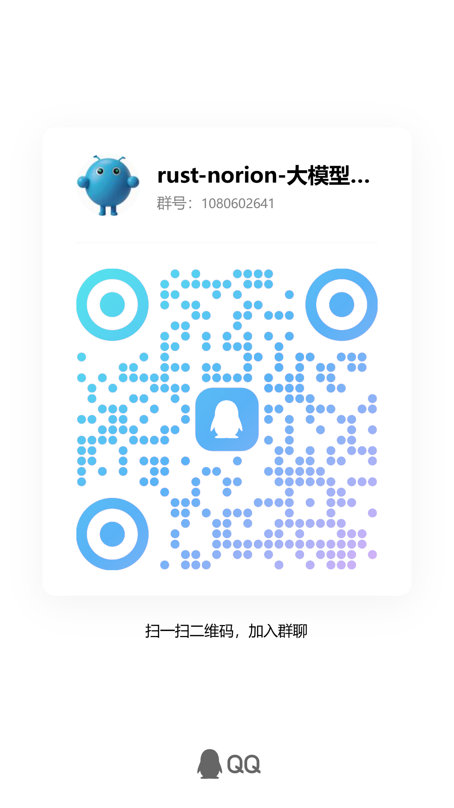
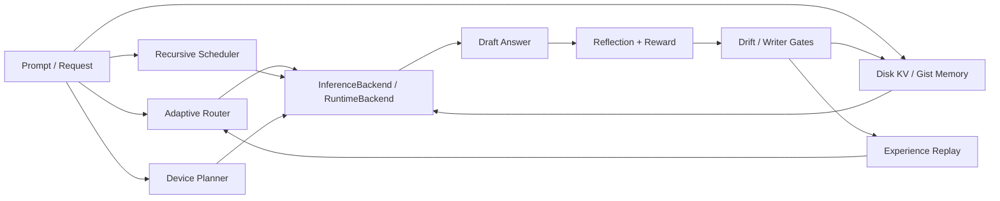

<div align="center">
  <p><strong>技术交流群</strong></p>
  
</div>

# rust-norion

`rust-norion` 是一个 DNA 启发的 Rust 推理控制层引擎原型，用来研究和实现长上下文治理、磁盘 KV 记忆、推理基因链 / Gene Scissors、自进化门禁，以及可插拔推理后端。

它不是已经训练完成的生产级大模型内核，而是围绕自研 Transformer runtime 或其他可审计后端的本地推理控制层。

## 当前状态

| 领域 | 状态 |
| --- | --- |
| 控制层 | 可运行原型，覆盖 adaptive routing、层级调度、反思、经验回放、drift gate 和状态检查。 |
| 记忆系统 | 已有磁盘 KV / gist / experience state 的本地持久化、inspection、hygiene 和 gate 入口。 |
| 推理基因链 | 正在推进 DNA/NDA-style reasoning genes、Gene Scissors、剪切 / 变异 / 修复与回滚审计。 |
| 后端边界 | 支持 built-in/local runtime、command runtime、manifest-backed production runtime 边界和 reference kernel。 |
| 生产推理内核 | 尚未接入真实训练权重和生产 forward kernel；当前 reference kernel 主要用于 ABI / gate 验证。 |

更细的长期目标见 [ROADMAP.md](ROADMAP.md)，研究草稿见 [Bio-Inspired Inference Control Report](docs/research/bio-inspired-inference-control-report.tex)。

## 适合 / 不适合

适合：

- 研究本地优先、离线优先、可审计的推理控制层。
- 实验长上下文路由、KV 记忆、经验回放、反思评分和自进化门禁。
- 给自研 Transformer-family runtime 或外部命令后端设计稳定接入边界。
- 贡献 Rust 控制层、memory、runtime ABI、benchmark、runbook、文档和治理规则。

不适合：

- 直接拿来当生产级 LLM serving kernel。
- 把项目理解成 Gemma、Llama、Qwen 或闭源模型服务的封装器。
- 绕过 GPL-3.0、第三方模型 / 数据许可证、维护者审核或写入门禁。
- 在没有验证证据和回滚方案的情况下开启持久 self-evolution mutation。

## 快速开始

确认 workspace 可以构建：

```powershell
cargo check -q --workspace
```

运行一个本地推理控制 demo：

```powershell
cargo run -- --profile coding "Build a Rust Noiron inference control layer"
```

只读检查本地持久状态，不触发真实模型推理：

```powershell
cargo run -- --inspect-state --inspect-limit 5
```

查看设备 profile 和执行计划门禁：

```powershell
cargo run -- --list-devices
cargo run -- --device-gate
```

运行轻量测试：

```powershell
cargo test -q --workspace
```

`crates/norion-cli` 目前是 no-backend 协议 shell，可用于验证 CLI/TUI 参数和前端协议：

```powershell
cargo run -q -p norion-cli -- --help
```

## 核心能力概览



- 长上下文治理：recursive scheduling、global/local KV separation、sparse context filtering、device-aware KV budget。
- 磁盘 KV 记忆：Hot/Warm/Cold state、gist memory、experience replay、memory hygiene inspection。
- 推理基因链：reasoning genes、Gene Scissors、剪切 / 拼接 / 变异候选、隔离、修复和可回滚演化证据。
- 自进化门禁：preview-first writer gate、drift guard、rollback anchor、validation evidence 和审计日志。
- 可插拔后端：`InferenceBackend`、`ModelRuntime`、`RuntimeBackend`、`RuntimeManifest`、production reference kernel。
- 全设备适配：CPU、GPU、统一内存、服务器、移动 / 边缘 / WASM / tiny target 等显式 device profile 与可移植 fallback。

## 仓库导航

| 路径 | 用途 |
| --- | --- |
| `src/` | root demo、服务协议、控制层实验和 CLI gate。 |
| `crates/norion-core` | 控制层核心抽象、runtime 边界、路由、KV、硬件 profile。 |
| `crates/norion-memory` | 记忆、gist、经验、索引、迁移与治理。 |
| `crates/norion-agent` | agent workflow、任务分配、反思、执行与协作结构。 |
| `crates/norion-cli` | no-backend CLI/TUI 协议 shell。 |
| `docs/architecture` | 架构、边界和设计说明。 |
| `docs/governance` | 协作、写入门禁、研究部署和 clean-room 规则。 |
| `docs/runbooks` | 本地 / 远程模型链路和运维验证步骤。 |
| `ROADMAP.md` | 优先级更细的长期路线图。 |

## 路线与 Issue 入口

当前优先级围绕这些方向收敛：

- 生产 runtime ABI：manifest gate、KV import/export、reference kernel、真实自研 forward kernel 接入。
- 长上下文与记忆：磁盘 KV、gist 层级、experience replay、memory hygiene 和跨设备状态治理。
- 推理基因链：gene schema、Gene Scissors transaction journal、变异修复、隔离和回滚策略。
- 自进化安全：preview-to-write graduation、统一 writer gate、drift / rollback 证据和可复现 benchmark。
- 开发者体验：quickstart、runbook、trace schema、CI gate、贡献者任务拆分。

入口：

- GitHub Issues / PR：[yanghao1143/rust-norion](https://github.com/yanghao1143/rust-norion)
- Gitee 同步仓库：[babalibaba/rust-norion](https://gitee.com/babalibaba/rust-norion)
- 路线图：[ROADMAP.md](ROADMAP.md)
- 开源社区计划：[docs/governance/open-source-community.md](docs/governance/open-source-community.md)
- 公共协作治理：[docs/governance/public-collaboration.md](docs/governance/public-collaboration.md)

GitHub Issues / PR 是主要 review 面；Gitee 用于同步和国内访问协作。

## 贡献入口

欢迎贡献代码、测试、文档、runbook、benchmark、架构 review、issue triage 和研究复现实验。非平凡改动建议先开 issue；memory、routing、runtime、self-evolution、genome、governance、agent-team 或 tooling 相关改动必须带验证证据和回滚思路。

贡献者可在其自有贡献范围内，并在本项目许可证允许范围内进行商用、部署研究、修改和分发。主项目许可证、copyleft 义务、第三方素材边界、维护者审核和商业边界以 [LICENSE](LICENSE)、[CONTRIBUTING.md](CONTRIBUTING.md)、[NOTICE.md](NOTICE.md) 以及治理文档为准。

贡献前请先看：

- [CONTRIBUTING.md](CONTRIBUTING.md)
- [NOTICE.md](NOTICE.md)
- [Public Collaboration Governance](docs/governance/public-collaboration.md)
- [Branch Protection Checklist](docs/governance/branch-protection-checklist.md)
- [Clean-room Implementation Audit](docs/governance/clean-room-implementation-audit.md)

受保护分支合并必须经过仓库所有者或维护者审核批准。PR 不会绕过 branch protection、验证门禁、署名要求或第三方许可证责任。

## License

本仓库采用 [GNU General Public License v3.0](LICENSE)。

在 GPL-3.0 条款下，允许商用、部署研究、修改和分发；派生作品和再分发修改也必须在 GPL-3.0 兼容条款下开源，并按许可证保留署名和提供源代码。

研究部署仍需遵守适用法律、隐私义务、安全要求、第三方模型 / 数据许可证和本地策略。详细边界见 [NOTICE.md](NOTICE.md) 与 [Local Research Deployment Profiles](docs/governance/local-research-deployment-profiles.md)。

## 深入阅读

- [Focused Development Strategy](docs/architecture/focused-development-strategy.md)
- [Reasoning Genome Chain](docs/architecture/reasoning-genome-chain.md)
- [Runtime Session State API](docs/architecture/runtime-session-state-api.md)
- [Memory Hygiene](docs/memory-hygiene-cn.md)
- [RustGPT Lab](docs/rustgpt-lab-cn.md)
- [Research report checklist](docs/research/README.md)
