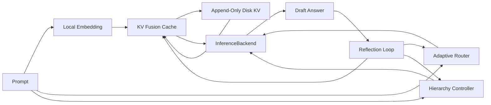

# rust-norion

`rust-norion` is a Rust prototype for a local Noiron-style self-evolving
inference control layer.

`rust-norion` 是一个用 Rust 编写的本地 Noiron 风格自进化推理控制层原型。

## Project Goal / 项目目标

The goal is to build a practical local inference control engine that can make a
model backend behave more adaptively over time without retraining model weights
on every interaction.

本项目目标是构建一个实用的本地推理控制引擎，让模型后端在不频繁重训权重的前提下，能够随着使用逐步调整推理策略、记忆选择和计算分配。

The project focuses on the control loop around inference:

项目重点不是从零实现完整大模型，而是实现推理外层闭环：

- adaptive routing: decide when a token should use cheaper projection or heavier
  attention
- reinforced KV memory: store useful context, fuse similar memories, weaken bad
  memories, and persist local state
- task-aware hierarchy: shift global, local, and convolution-style compute
  weights for coding, writing, general reasoning, or long-document tasks
- reflection loop: score drafts, detect weak outputs, revise confidence, and
  decide what should become reusable memory
- backend abstraction: keep the control layer independent from the actual model
  runtime

- 自适应路由：判断 token 应该走低成本投影还是更重的注意力路径
- 强化式 KV 记忆：保存有用上下文，融合相似记忆，削弱错误记忆，并持久化到本地
- 任务感知层级调度：针对代码、写作、通用推理、长文档任务调整全局/局部/卷积式计算权重
- 反思闭环：评估草稿质量，发现薄弱输出，修正置信度，并决定是否写入可复用记忆
- 后端抽象：让控制层与真实模型运行时解耦

## Current Status / 当前状态

This repository currently contains a working control-plane prototype. It does
not yet include a real Transformer runtime.

当前仓库已经包含一个可运行的控制层原型，但还没有接入真实 Transformer 推理运行时。

Implemented modules:

已实现模块：

- `src/router.rs`: adaptive entropy router
- `src/disk_kv.rs`: append-only disk-backed KV store
- `src/kv_cache.rs`: reinforced KV fusion cache with disk persistence
- `src/hierarchy.rs`: task-profile hierarchy controller
- `src/reflection.rs`: draft reflection and memory admission logic
- `src/engine.rs`: closed-loop Noiron engine and `InferenceBackend` trait
- `src/main.rs`: CLI demo using `HeuristicBackend`

## Non-Goals / 非目标

This prototype does not claim that KV memory is equivalent to model-weight
training, and it does not claim to be a complete LLM runtime.

本原型不声称 KV 记忆等同于模型权重训练，也不声称自己已经是完整的大模型运行时。

The near-term engineering target is to make the control loop measurable,
testable, and replaceable before connecting a real model backend.

近期工程目标是先让控制闭环可测、可运行、可替换，再接入真实模型后端。

## Run / 运行

```powershell
cargo run -- --profile coding "Build a Rust Noiron inference engine"
```

By default, the demo writes local memory to `noiron-memory.tsv`. That file is
ignored by Git because it is local runtime state.

demo 默认会把本地记忆写入 `noiron-memory.tsv`。该文件属于本地运行状态，已被 Git 忽略。

## Test / 测试

```powershell
cargo test
```

## Architecture / 架构



## Backend Integration / 后端接入

To connect a real model, implement `InferenceBackend` and replace
`HeuristicBackend`.

要接入真实模型，需要实现 `InferenceBackend`，并替换当前 demo 使用的 `HeuristicBackend`。

Expected integration loop:

预期接入流程：

1. embed prompt and retrieve local memory
2. compute route budget and hierarchy weights
3. call the real model backend
4. reflect on the draft
5. reinforce or penalize memory
6. update routing threshold and hierarchy weights

1. 对 prompt 做嵌入并检索本地记忆
2. 计算路由预算和层级权重
3. 调用真实模型后端
4. 对草稿答案做反思评估
5. 强化或惩罚记忆
6. 更新路由阈值和层级权重

## Roadmap / 路线图

- replace heuristic embedding with model-side embeddings or compact vector
  encoders
- implement a candle or llama.cpp backend adapter
- add benchmark cases for long-context routing and memory reuse
- add configurable memory retention policies
- add structured tracing for every inference loop

- 用模型侧 embedding 或轻量向量编码器替换当前启发式 embedding
- 实现 candle 或 llama.cpp 后端适配器
- 增加长上下文路由和记忆复用 benchmark
- 增加可配置的记忆保留策略
- 为每次推理闭环增加结构化 trace
