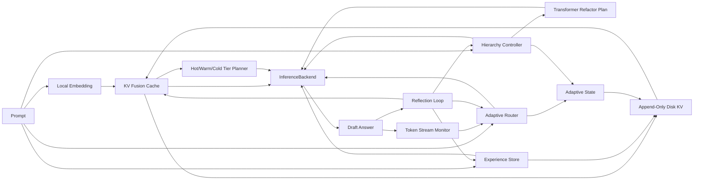

# rust-norion

`rust-norion` is a Rust prototype for a local Noiron-style self-evolving
inference control layer for self-developed Transformer runtimes.

`rust-norion` 是一个用 Rust 编写的本地 Noiron 风格自进化推理控制层原型，默认面向自主训练的
Transformer 运行时。

## Project Goal / 项目目标

The goal is to build a practical, sovereignty-first local inference control
engine that can make a self-developed model backend behave more adaptively over
time without retraining model weights on every interaction.

本项目目标是构建一个实用、自主可控优先的本地推理控制引擎，让自研模型后端在不频繁重训权重的前提下，能够随着使用逐步调整推理策略、记忆选择和计算分配。

The project focuses on the control loop around inference:

项目重点不是从零实现完整大模型，而是实现推理外层闭环：

- multi-factor adaptive routing: decide when a token should use projection,
  local-window attention, global attention, or convolutional fusion based on
  entropy, task profile, context length, cache hit rate, and latency pressure
- reinforced KV memory: store useful context, fuse similar memories, weaken bad
  memories, and persist local state
- task-aware hierarchy: shift global, local, and convolution-style compute
  weights for coding, writing, general reasoning, or long-document tasks
- Rust-native Transformer refactor planning: express global, local-window, and
  convolutional-fusion layer plans as explicit Rust data structures
- reflection loop: score drafts, detect weak outputs, revise confidence, and
  decide what should become reusable memory
- backend abstraction: keep the control layer independent from the actual model
  runtime

- 多因子自适应路由：基于熵、任务类型、上下文长度、缓存命中率和延迟压力，判断 token 应该走投影、局部窗口注意力、全局注意力还是卷积融合
- 强化式 KV 记忆：保存有用上下文，融合相似记忆，削弱错误记忆，并持久化到本地
- 任务感知层级调度：针对代码、写作、通用推理、长文档任务调整全局/局部/卷积式计算权重
- Rust 原生 Transformer 重构规划：用明确的 Rust 数据结构表达全局注意力、局部窗口注意力和卷积融合层计划
- 反思闭环：评估草稿质量，发现薄弱输出，修正置信度，并决定是否写入可复用记忆
- 后端抽象：让控制层与真实模型运行时解耦

## Sovereignty Scope / 自主可控范围

The default target is a self-trained Transformer-family model. The core project
does not depend on Gemma, Llama, Qwen, closed model services, or vendor-specific
runtime features. Public papers and open algorithm ideas can guide the design,
but quantization, attention routing, memory scheduling, reflection, and adaptive
state should be implemented as local Rust components.

默认目标是自主训练的 Transformer 系列模型。核心项目不依赖 Gemma、Llama、Qwen、闭源模型服务或厂商绑定运行时能力。可以借鉴公开论文和开放算法思想，但量化、注意力路由、记忆调度、反思闭环和自适应状态都应作为本地 Rust 组件自主实现。

## Current Status / 当前状态

This repository currently contains a working control-plane prototype. It does
not yet include the self-developed Transformer runtime or production inference
kernels.

当前仓库已经包含一个可运行的控制层原型，但还没有接入自研 Transformer 运行时或生产级推理内核。

Implemented modules:

已实现模块：

- `src/router.rs`: multi-factor adaptive router
- `src/adaptive_state.rs`: persisted router and hierarchy control state
- `src/disk_kv.rs`: append-only disk-backed KV store
- `src/kv_cache.rs`: reinforced KV fusion cache with disk persistence
- `src/kv_quant.rs`: self-owned 4/8-bit uniform KV vector quantization
- `src/tiered_cache.rs`: Hot/Warm/Cold memory tier scheduler
- `src/token_stream.rs`: generated-token window monitor for router feedback
- `src/experience.rs`: structured reflection experience store
- `src/transformer.rs`: Rust-native Transformer layer refactor planner
- `src/hierarchy.rs`: task-profile hierarchy controller
- `src/reflection.rs`: draft reflection and memory admission logic
- `src/runtime.rs`: model runtime adapter contract for real LLM backends
- `src/engine.rs`: closed-loop Noiron engine and `InferenceBackend` trait
- `src/main.rs`: CLI demo using `HeuristicBackend`

## Non-Goals / 非目标

This prototype does not claim that KV memory is equivalent to model-weight
training, and it does not claim to be a complete LLM runtime.

本原型不声称 KV 记忆等同于模型权重训练，也不声称自己已经是完整的大模型运行时。

The near-term engineering target is to make the control loop measurable,
testable, and replaceable before connecting a real model backend.

近期工程目标是先让控制闭环可测、可运行、可替换，再接入真实模型后端。

## Run / 运行

```powershell
cargo run -- --profile coding "Build a Rust Noiron inference engine"
```

Run through a local command runtime:

```powershell
cargo run -- --runtime-command ./self-transformer-cli --runtime-arg "-p" --runtime-arg "{prompt}" --runtime-prompt-mode args "Build a Rust Noiron inference engine"
```

If `--runtime-prompt-mode stdin` is used, the formatted Noiron runtime request is
written to the child process stdin.

By default, the demo writes local memory to `noiron-memory.tsv`, structured
reflection experience to `noiron-experience.ndkv`, and adaptive router/hierarchy
state to `noiron-adaptive.ndkv`. These files are ignored by Git because they are
local runtime state.

demo 默认会把本地记忆写入 `noiron-memory.tsv`，并把结构化反思经验写入
`noiron-experience.ndkv`，同时把自适应路由和层级权重状态写入
`noiron-adaptive.ndkv`。这些文件属于本地运行状态，已被 Git 忽略。

## Test / 测试

```powershell
cargo test
```

## Architecture / 架构



## Backend Integration / 后端接入

To connect a real model, implement `ModelRuntime` and wrap it in
`RuntimeBackend`, or implement `InferenceBackend` directly for a custom
self-developed runtime surface.

要接入真实模型，可以实现 `ModelRuntime` 并用 `RuntimeBackend` 包装，也可以为更定制的自研运行时控制面直接实现 `InferenceBackend`，替换当前 demo 使用的 `HeuristicBackend`。

Expected integration loop:

预期接入流程：

1. embed prompt and retrieve local memory
2. compute route budget and hierarchy weights
3. retrieve relevant reflection lessons from the experience store
4. call the real model backend
5. reflect on the draft
6. reinforce or penalize memory
7. update routing threshold, hierarchy weights, and experience records

1. 对 prompt 做嵌入并检索本地记忆
2. 计算路由预算和层级权重
3. 从经验库检索相关反思 lesson
4. 调用真实模型后端
5. 对草稿答案做反思评估
6. 强化或惩罚记忆
7. 更新路由阈值、层级权重和经验记录

## Roadmap / 路线图

The optimized roadmap is tracked in [`ROADMAP.md`](ROADMAP.md).

优化后的路线图维护在 [`ROADMAP.md`](ROADMAP.md)。

- replace heuristic embedding with model-side embeddings or compact vector
  encoders
- implement a self-developed Transformer runtime adapter
- expand mixed-precision 4/8-bit KV quantization benchmarks and policies
- add Infini-style global/local KV separation and sparse context filtering
- add recursive scheduling for inputs beyond the native model window
- add benchmark cases for long-context routing and memory reuse
- add configurable memory retention policies
- add structured tracing for every inference loop

- 用模型侧 embedding 或轻量向量编码器替换当前启发式 embedding
- 实现自研 Transformer 运行时适配器
- 扩展 4/8-bit 混合精度 KV 量化 benchmark 和策略
- 增加 Infini 风格全局/局部 KV 分离和稀疏上下文筛选
- 增加超过模型原生窗口输入的递归调度
- 增加长上下文路由和记忆复用 benchmark
- 增加可配置的记忆保留策略
- 为每次推理闭环增加结构化 trace
