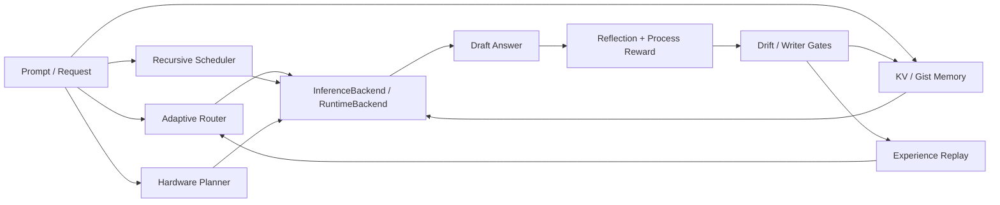

<div align="center">
  <p><strong>技术交流群</strong></p>
  
</div>

# rust-norion

`rust-norion` 是一个 DNA 启发的 Rust 推理控制层 / 自进化控制引擎原型。
它关注推理外层的路由、记忆、反思、设备适配和后端边界，而不是已经训练完成的生产级大模型推理内核。

当前项目可以理解为：

- 一个可运行的控制层原型：能跑本地启发式后端、状态检查、benchmark/gate 和服务协议验证。
- 一个后端适配层：支持内置 local runtime、manifest-backed production runtime 边界、外部命令 runtime / 远程模型链路接入。
- 一个研究工程仓库：用于验证 DNA/NDA reasoning genes、Gene Scissors、KV 记忆、经验回放和可审计自进化门禁。

当前项目不是：

- 已经生产可用的大模型推理内核。
- 对 Gemma、Llama、Qwen 或闭源模型服务的封装器。
- 绕过 GPL、第三方模型/数据许可证或维护者审核的商用交付物。

## 当前成熟度

| 领域 | 状态 |
| --- | --- |
| 控制层闭环 | 可运行原型，覆盖路由、层级调度、记忆、反思、经验回放和 drift gate。 |
| 本地/远程后端 | 已有 built-in/local runtime、command runtime、manifest/device gate 和远程 Gemma 链路适配。 |
| 生产推理内核 | 仅有 deterministic reference production kernel / ABI harness；真实训练权重和生产 forward kernel 尚未接入。 |
| 自进化能力 | 以 preview/gate/rollback 为主，强调证据、审计和写入门禁，不默认放开持久 mutation。 |
| 文档与协作 | README 作为入口；长背景、架构、治理和路线图放在 `docs/` 与 `ROADMAP.md`。 |

## 快速运行与验证

先确认 Rust workspace 能构建：

```powershell
cargo check -q --workspace
```

运行一个本地 demo 推理控制流程：

```powershell
cargo run -- --profile coding "Build a Rust Noiron inference control layer"
```

检查本地持久状态，不触发真实模型推理：

```powershell
cargo run -- --inspect-state --inspect-limit 5
```

查看设备 profile / 执行计划门禁：

```powershell
cargo run -- --list-devices
cargo run -- --device-gate
```

运行轻量测试：

```powershell
cargo test -q --workspace
```

`crates/norion-cli` 目前是 no-backend 协议 shell，用于验证 CLI/TUI 路由参数和前端协议，不会启动 Gemma、连接远端模型或发送 prompt：

```powershell
cargo run -q -p norion-cli -- --help
```

更多本地/远程模型链路见：

- [RustGPT Lab](docs/rustgpt-lab-cn.md)
- [Gemma local chain runbook](docs/runbooks/gemma-local-chain.md)
- [Gemma remote unattended status](docs/runbooks/gemma-remote-unattended-status.md)
- [SmartSteam Forge evolution daemon](docs/runbooks/smartsteam-forge-evolution-daemon.md)

## 核心架构



主要边界：

- `InferenceBackend`：控制层调用真实后端的最小抽象。
- `ModelRuntime` / `RuntimeBackend`：把自研或外部命令 runtime 包装进同一条控制链路。
- `RuntimeManifest` / `ProductionTransformerRuntime`：在加载生产资产前验证模型元数据、设备契约、KV ABI 和 adapter 选择。
- `norion-memory` / root memory modules：管理 KV、gist、经验、语义索引和写入门禁。
- `norion-agent` / service modules：承接 agent workflow、HTTP service、模型池和前端协议。

更完整的架构说明见：

- [项目背景与长说明](docs/project-context.md)
- [norion-core](docs/architecture/norion-core.md)
- [norion-memory](docs/architecture/norion-memory.md)
- [norion-agent](docs/architecture/norion-agent.md)
- [Reasoning Genome Chain](docs/architecture/reasoning-genome-chain.md)
- [Runtime session state API](docs/architecture/runtime-session-state-api.md)

## 仓库导航

| 路径 | 用途 |
| --- | --- |
| `src/` | root demo、服务协议、控制层实验和 CLI gate。 |
| `crates/norion-core` | 控制层核心抽象、runtime 边界、路由、KV、硬件 profile。 |
| `crates/norion-memory` | 记忆、gist、经验、索引、迁移与治理。 |
| `crates/norion-agent` | agent 工作流、任务分配、反思、执行与协作结构。 |
| `crates/norion-cli` | no-backend CLI/TUI 协议 shell。 |
| `docs/architecture` | 架构、边界和设计说明。 |
| `docs/governance` | 协作、写入门禁、研究部署和 clean-room 规则。 |
| `docs/runbooks` | 本地/远程模型链路和运维验证步骤。 |
| `ROADMAP.md` | 优先级更细的长期路线图。 |

## 贡献者专区

rust-norion 需要很多人一起把控制层、记忆、runtime 边界、文档和实验跑实。贡献者不只是提交代码的人，也包括写 runbook、复现实验、补测试、做架构 review、整理 issue、接入后端、改进中文/英文文档的人。

这里会认真给贡献者留位置：可署名、可展示、可进入 Hall of Fame、可在 release notes 里被点名，也可以按规则晋升为 Trusted Contributor、Reviewer、Module Collaborator 或 Maintainer。

想留下名字、展示成果、认领方向，先看：

- [贡献者专区与荣誉墙](docs/contributor-zone.md)
- [贡献者角色与审核规则](docs/governance/contributor-roles-and-review.md)
- [贡献规则](CONTRIBUTING.md)
- [路线图](ROADMAP.md)

可以优先认领的方向：

| 方向 | 适合贡献 |
| --- | --- |
| 控制层核心 | routing、hierarchy、reflection、scheduler、writer gate 的测试、trace 和小步实现。 |
| 记忆系统 | KV/Gist memory、经验检索、memory hygiene、语义索引、状态迁移。 |
| Runtime 边界 | `ModelRuntime`、manifest gate、command runtime、reference kernel、设备 profile。 |
| 文档与教程 | 新人 quickstart、中文 runbook、架构图、FAQ、实验复现记录。 |
| Benchmark / CI | 可复现 benchmark、轻量 gate、失败样例、trace schema 验证。 |
| 社区协作 | issue triage、任务拆分、PR review、贡献者周报、成果展示。 |

贡献者可以在 PR 里附上 “Contributor Card”。合并后可进入专区索引；重要模块贡献会在 release notes、README 链接或 docs 荣誉墙里展示。Reviewer / Module Collaborator 的晋升有明确标准，但受保护分支仍需要 owner / CODEOWNER 审核，仓库不会因为扩大社区而牺牲安全边界。

## 后端接入边界

接入真实模型时优先实现 `ModelRuntime`，再用 `RuntimeBackend` 接入控制层；高度定制的自研运行时也可以直接实现 `InferenceBackend`。

推荐接入顺序：

1. 先用 built-in/local runtime 或 reference production kernel 跑通控制层 gate。
2. 用 `RuntimeManifest` 固化 model id、tokenizer、context window、embedding 维度、层数、head 数、KV import/export 和设备适配信息。
3. 通过 `--runtime-manifest-gate` / `--production-kernel-conformance-gate` 验证 ABI、设备契约和输出证据。
4. 再把真实 forward kernel 或外部命令 runtime 放到同一条边界后面。

## 贡献与协同

欢迎 issue、PR、文档、测试、runbook 和研究复现实验贡献。非平凡改动建议先开 issue，memory、routing、runtime、self-evolution、genome、governance、agent-team 或 tooling 相关改动必须带验证证据和回滚思路。

协同入口：

- GitHub 主仓库：[yanghao1143/rust-norion](https://github.com/yanghao1143/rust-norion)
- Gitee 同步仓库：[babalibaba/rust-norion](https://gitee.com/babalibaba/rust-norion)
- 贡献规则：[CONTRIBUTING.md](CONTRIBUTING.md)
- 公共协作治理：[docs/governance/public-collaboration.md](docs/governance/public-collaboration.md)
- 开源社区计划：[docs/governance/open-source-community.md](docs/governance/open-source-community.md)

GitHub Issues / PR 是主要 review 面；Gitee 用于同步和国内访问协作。受保护分支合并必须经过仓库所有者或维护者审核批准。

## License 与商用边界

本仓库采用 [GNU General Public License v3.0](LICENSE)。

在 GPL-3.0 条款下，允许商用、研究部署、修改和分发；派生作品和再分发修改也必须在 GPL-3.0 兼容条款下开源，并按许可证保留署名和提供源代码。

贡献者和下游用户适用同一套 copyleft 义务。PR 不会绕过维护者审核、branch protection、验证门禁、署名要求或第三方许可证责任。研究部署仍需遵守适用法律、隐私义务、安全要求、第三方模型/数据许可证和本地策略。

详细说明见：

- [NOTICE.md](NOTICE.md)
- [Public Collaboration Governance](docs/governance/public-collaboration.md)
- [Local Research Deployment Profiles](docs/governance/local-research-deployment-profiles.md)

## 深入阅读

- [ROADMAP.md](ROADMAP.md)
- [Focused Development Strategy](docs/architecture/focused-development-strategy.md)
- [Bio-Inspired Inference Control Report](docs/research/bio-inspired-inference-control-report.tex)
- [Research report checklist](docs/research/README.md)
- [External agent baselines](docs/architecture/external-agent-baselines.md)
